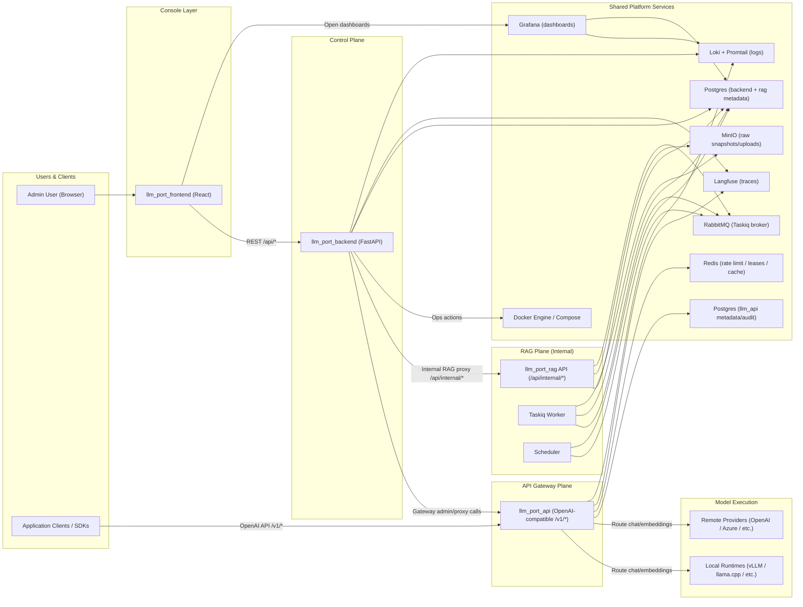

# Architecture

This page describes the high-level architecture of **llm.Port** — the planes, services, and data flows that make up the platform.

## Platform Overview

## Planes

### Console Layer

The **React frontend** provides the admin console — a single-page app for managing providers, models, containers, RAG, PII policies, and system settings.

### Control Plane

The **FastAPI backend** is the central orchestrator. It handles:

- User management, RBAC, and authentication
- LLM provider and runtime configuration
- Container lifecycle management via the Docker API
- System settings with crypto and apply orchestration
- Proxying internal requests to RAG and the gateway

### API Gateway Plane

The **gateway** exposes an OpenAI-compatible API (`/v1/models`, `/v1/chat/completions`, `/v1/embeddings`). It handles:

- Alias-based model resolution and provider routing
- JWT authentication with tenant-aware claims
- Redis-based rate limiting and concurrency leasing
- SSE streaming with TTFT extraction
- Langfuse tracing and audit logging

### RAG Plane

The **RAG subsystem** is an internal service accessed only through the backend. It manages:

- Document ingestion: upload → extract → chunk → embed → index
- Knowledge search: vector, keyword, and hybrid scoring with ACL enforcement
- Virtual containers with draft/publish workflows
- Async processing via Taskiq + RabbitMQ

### Shared Platform Services

Infrastructure containers managed via Docker Compose:

| Service       | Purpose                                                 |
| ------------- | ------------------------------------------------------- |
| PostgreSQL    | Backend metadata, RAG vectors (pgvector), gateway audit |
| Redis         | Rate limiting, concurrency leases, caching              |
| RabbitMQ      | Async task broker (Taskiq)                              |
| MinIO         | Object storage for uploads and snapshots                |
| Langfuse      | LLM trace and generation event storage                  |
| Loki + Alloy  | Centralized log collection and querying                 |
| Grafana       | Dashboard and visualization                             |
| Docker Engine | Container orchestration for runtimes                    |

## Calling Paths

1. **Admin operations** — `Browser → Frontend → Backend → Docker / Settings / Proxy targets`
2. **Application inference** — `App/SDK → Gateway → local runtime or remote provider → response`
3. **RAG query** — `Frontend → Backend /api/admin/rag/* → RAG /api/internal/knowledge/search`
4. **RAG publish** — `Upload → MinIO → RabbitMQ → Worker → extract/chunk/embed/index`
5. **Observability** — `Backend + Gateway + RAG → Loki / Langfuse → Grafana dashboards`

For detailed sequence diagrams of each flow, see [Call Sequences](/docs/call-sequences).
