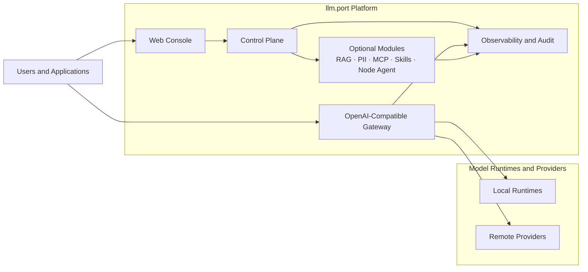

# Architecture

This architecture view is intentionally high-level: it explains system boundaries and responsibility split without exposing internal operational or security-sensitive implementation details.

## High-level architecture

## Design principles

- **Clear separation of concerns** between user interaction, traffic handling, governance, and optional capabilities
- **Gateway-first integration** so client applications can standardize on one API surface
- **Modular growth path** so teams can add capabilities as maturity and compliance needs evolve
- **Operational transparency** through observability and audit-friendly workflows

## What this means for adopters

- Faster onboarding with fewer integration touchpoints
- Controlled AI operations across local and remote model strategies
- Better confidence for platform, security, and compliance stakeholders

## Related pages

- [Platform Overview](./platform-overview.md)
- [API Gateway](../integrate/api-gateway.md)
- [Security Overview](../features/security-overview.md)
