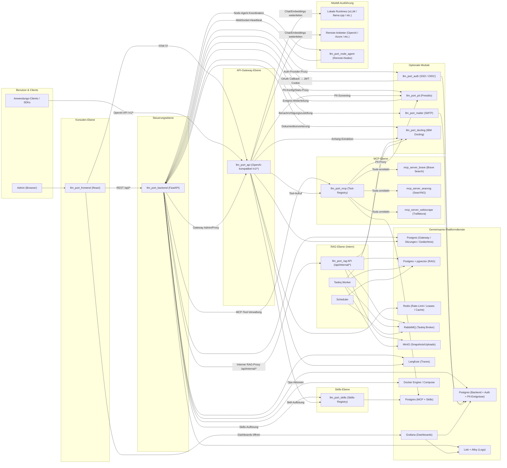

# Architektur

Diese Seite beschreibt die übergeordnete Architektur von **llm.Port** — die Ebenen, Dienste und Datenflüsse der Plattform.

## Plattformüberblick

## Ebenen

### Konsolen-Ebene

Das **React-Frontend** stellt die Admin-Konsole bereit — eine Single-Page-App zur Verwaltung von Anbietern, Modellen, Containern, RAG, PII-Richtlinien und Systemeinstellungen.

### Steuerungsebene

Das **FastAPI-Backend** ist der zentrale Orchestrator. Es verwaltet:

- Benutzerverwaltung, RBAC und Authentifizierung
- LLM-Anbieter- und Runtime-Konfiguration
- Container-Lifecycle-Management über die Docker-API
- Systemeinstellungen mit Krypto- und Apply-Orchestrierung
- Proxying interner Anfragen an RAG und das Gateway

### API-Gateway-Ebene

Das **Gateway** stellt eine OpenAI-kompatible API bereit (`/v1/models`, `/v1/chat/completions`, `/v1/embeddings`). Es verarbeitet:

- Alias-basierte Modellauflösung und Anbieter-Routing
- JWT-Authentifizierung mit mandantenspezifischen Claims
- Redis-basiertes Rate-Limiting und Concurrency-Leasing
- SSE-Streaming mit TTFT-Extraktion
- Langfuse-Tracing und Audit-Logging
- Chat-Sitzungen, Gedächtnis-Fakten und Dateianhänge
- PII-Screening über das PII-Modul

### Optionale Module

Separate Dienste, die über Docker Compose Profile aktiviert oder deaktiviert werden können:

- **Auth** — SSO / OIDC-Authentifizierung mit OAuth-Provider-Adaptern
- **PII** — Presidio-basiertes PII-Scanning, Anonymisierung und Tokenisierung
- **Mailer** — E-Mail-Benachrichtigungen mit Jinja2-Vorlagen
- **Docling** — IBM Docling-basierte Dokumentverarbeitung für Textextraktion

### MCP-Ebene

Die **MCP-Tool-Registry** (`llm_port_mcp`) ist ein gesteuerter Broker für Model-Context-Protocol-Tool-Server:

- Registriert MCP-kompatible Server (stdio, SSE, Streamable HTTP-Transporte)
- Ermittelt automatisch Tools und konvertiert sie in OpenAI-kompatible Tool-Definitionen
- Leitet alle Tool-Aufrufe durch einen **Privacy Proxy** (Presidio-basierte PII-Erkennung)
- Verschlüsselt Server-Anmeldedaten mit Fernet

Integrierte MCP-Server: **Brave Search**, **SearXNG** (selbstgehostet, kein API-Schlüssel) und **Web Scrape** (Trafilatura-basierte Content-Extraktion).

### Skills-Ebene

Die **Skills-Registry** (`llm_port_skills`) verwaltet wiederverwendbare Reasoning-Playbooks. Skills sind Markdown-Dokumente mit YAML-Frontmatter, die bestimmen, wie das System über bestimmte Anfrageklassen nachdenkt — zwischen RAG-Kontext, MCP-Tools und Prompt-Komposition.

### Node-Agent

Der **Node-Agent** (`llm_port_node_agent`) ist ein leichtgewichtiges Host-seitiges Binary für Multi-Node-Deployments:

- Registrierung beim Backend mit einem Einmal-Token
- Aufrechterhaltung einer authentifizierten WebSocket-Verbindung für Heartbeats und Befehlsdispatch
- Ausführung von Docker-Runtime-Lifecycle-Befehlen auf Remote-Nodes
- Log-Weiterleitung an Loki (journald unter Linux, Event Log unter Windows)
- Verteilung als Standalone-Binaries (kein Python auf dem Node erforderlich)

### RAG-Ebene

Das **RAG-Subsystem** ist ein interner Dienst, der nur über das Backend zugänglich ist. Es verwaltet:

- Dokumentenaufnahme: Hochladen → Extrahieren → Aufteilen → Einbetten → Indexieren
- Wissenssuche: Vektor-, Stichwort- und Hybridscoring mit ACL-Durchsetzung
- Virtuelle Container mit Entwurf-/Veröffentlichungs-Workflows
- Asynchrone Verarbeitung via Taskiq + RabbitMQ

### Gemeinsame Plattformdienste

Infrastruktur-Container, die über Docker Compose verwaltet werden:

| Dienst        | Zweck                                                                                                     |
| ------------- | --------------------------------------------------------------------------------------------------------- |
| PostgreSQL    | Backend + Auth-Metadaten + PII-Ereignisse, Gateway-Sitzungen/Gedächtnis, RAG-Vektoren, MCP + Skills-Daten |
| Redis         | Rate-Limiting, Concurrency-Leases, Caching                                                                |
| RabbitMQ      | Asynchroner Task-Broker (Taskiq)                                                                          |
| MinIO         | Objektspeicher für Uploads und Snapshots                                                                  |
| Langfuse      | LLM-Trace- und Generation-Ereignisspeicher                                                                |
| Loki + Alloy  | Zentrale Log-Sammlung und -Abfrage                                                                        |
| Grafana       | Dashboard und Visualisierung                                                                              |
| Docker Engine | Container-Orchestrierung für Runtimes                                                                     |

## Aufrufpfade

1. **Admin-Operationen** — `Browser → Frontend → Backend → Docker / Settings / Proxy-Ziele`
2. **Anwendungs-Inferenz** — `App/SDK → Gateway → lokale Runtime oder Remote-Anbieter → Antwort`
3. **Chat Completions (Konsole)** — `Browser → Frontend → Backend (Cookie→JWT-Proxy) → Gateway /v1/chat/completions → Anbieter → SSE-Antwort`
4. **RAG-Abfrage** — `Frontend → Backend /api/admin/rag/* → RAG /api/internal/knowledge/search`
5. **RAG-Veröffentlichung** — `Upload → MinIO → RabbitMQ → Worker → Docling-Extraktion → Aufteilen → Einbetten → pgvector-Index`
6. **PII-Screening** — `Gateway (Pre-Forward-Middleware) → PII /analyze → Anonymisieren/Flaggen → Fortfahren oder Ablehnen`
7. **SSO-Authentifizierung** — `Browser → Auth /login/<provider> → IdP → Auth /callback → signiertes JWT → Backend (Cookie setzen)`
8. **Benachrichtigungszustellung** — `Backend (Outbox-Schreiben) → Dispatcher → Mailer /send → SMTP-Anbieter`
9. **Dokumentverarbeitung** — `Datei-Upload → Docling /convert → IBM Docling Pipeline → strukturierter Text → Aufrufer (RAG-Worker / Gateway)`
10. **Observability** — `Backend + Gateway + RAG → Loki / Langfuse → Grafana-Dashboards`
11. **MCP-Tool-Aufruf** — `Gateway → MCP-Hub → Privacy Proxy (PII-Scan) → MCP-Server → Tool-Ergebnis → Gateway`
12. **Skill-Auflösung** — `Gateway (Pre-Prompt) → Skills /resolve → passende Playbooks → Prompt-Komposition`
13. **Node-Agent-Dispatch** — `Backend → WebSocket → Node-Agent → Docker-Lifecycle-Befehl → Statusbericht`

Detaillierte Sequenzdiagramme für jeden Fluss finden Sie unter [Aufrufsequenzen](/docs/call-sequences).
