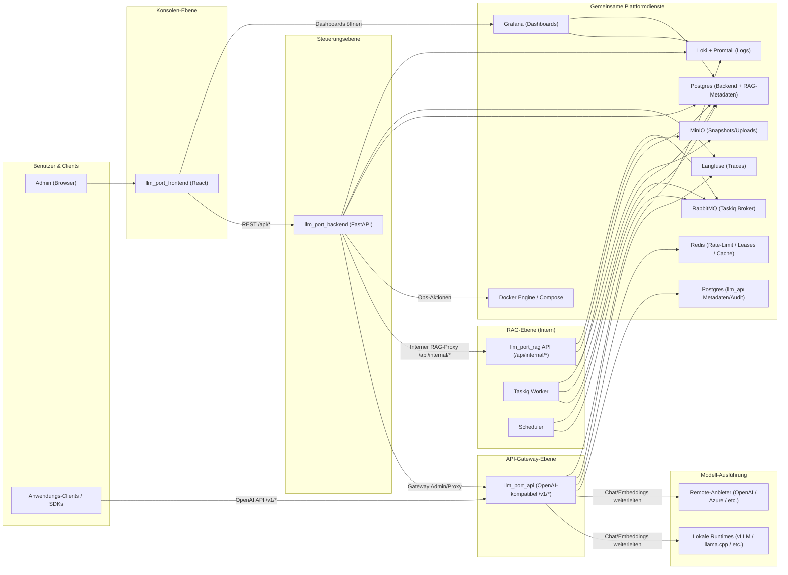

# Architektur

Diese Seite beschreibt die übergeordnete Architektur von **llm.Port** — die Ebenen, Dienste und Datenflüsse der Plattform.

## Plattformüberblick

## Ebenen

### Konsolen-Ebene

Das **React-Frontend** stellt die Admin-Konsole bereit — eine Single-Page-App zur Verwaltung von Anbietern, Modellen, Containern, RAG, PII-Richtlinien und Systemeinstellungen.

### Steuerungsebene

Das **FastAPI-Backend** ist der zentrale Orchestrator. Es verwaltet:

- Benutzerverwaltung, RBAC und Authentifizierung
- LLM-Anbieter- und Runtime-Konfiguration
- Container-Lifecycle-Management über die Docker-API
- Systemeinstellungen mit Krypto- und Apply-Orchestrierung
- Proxying interner Anfragen an RAG und das Gateway

### API-Gateway-Ebene

Das **Gateway** stellt eine OpenAI-kompatible API bereit (`/v1/models`, `/v1/chat/completions`, `/v1/embeddings`). Es verarbeitet:

- Alias-basierte Modellauflösung und Anbieter-Routing
- JWT-Authentifizierung mit mandantenspezifischen Claims
- Redis-basiertes Rate-Limiting und Concurrency-Leasing
- SSE-Streaming mit TTFT-Extraktion
- Langfuse-Tracing und Audit-Logging

### RAG-Ebene

Das **RAG-Subsystem** ist ein interner Dienst, der nur über das Backend zugänglich ist. Es verwaltet:

- Dokumentenaufnahme: Hochladen → Extrahieren → Aufteilen → Einbetten → Indexieren
- Wissensssuche: Vektor-, Stichwort- und Hybridscoring mit ACL-Durchsetzung
- Virtuelle Container mit Entwurf-/Veröffentlichungs-Workflows
- Asynchrone Verarbeitung via Taskiq + RabbitMQ

### Gemeinsame Plattformdienste

Infrastruktur-Container, die über Docker Compose verwaltet werden:

| Dienst        | Zweck                                                     |
| ------------- | --------------------------------------------------------- |
| PostgreSQL    | Backend-Metadaten, RAG-Vektoren (pgvector), Gateway-Audit |
| Redis         | Rate-Limiting, Concurrency-Leases, Caching                |
| RabbitMQ      | Asynchroner Task-Broker (Taskiq)                          |
| MinIO         | Objektspeicher für Uploads und Snapshots                  |
| Langfuse      | LLM-Trace- und Generation-Ereignisspeicher                |
| Loki + Alloy  | Zentrale Log-Sammlung und -Abfrage                        |
| Grafana       | Dashboard und Visualisierung                              |
| Docker Engine | Container-Orchestrierung für Runtimes                     |

## Aufrufpfade

1. **Admin-Operationen** — `Browser → Frontend → Backend → Docker / Settings / Proxy-Ziele`
2. **Anwendungs-Inferenz** — `App/SDK → Gateway → lokale Runtime oder Remote-Anbieter → Antwort`
3. **RAG-Abfrage** — `Frontend → Backend /api/admin/rag/* → RAG /api/internal/knowledge/search`
4. **RAG-Veröffentlichung** — `Upload → MinIO → RabbitMQ → Worker → Extrahieren/Aufteilen/Einbetten/Indexieren`
5. **Observability** — `Backend + Gateway + RAG → Loki / Langfuse → Grafana-Dashboards`

Detaillierte Sequenzdiagramme für jeden Fluss finden Sie unter [Aufrufsequenzen](/docs/call-sequences).
