# Aufrufsequenzen

Detaillierte Mermaid-Sequenzdiagramme für jeden wichtigen Fluss in **llm.Port**.

## 1. End-to-End-Überblick

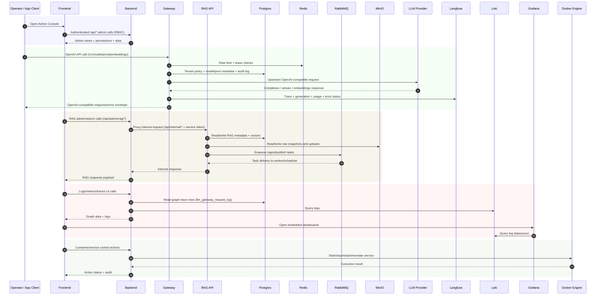
```mermaid
sequenceDiagram
    autonumber
    participant U as Operator / App Client
    participant FE as Frontend
    participant BE as Backend
    participant GW as Gateway
    participant RAG as RAG API
    participant PG as Postgres
    participant R as Redis
    participant RMQ as RabbitMQ
    participant MIO as MinIO
    participant LP as LLM Provider
    participant LF as Langfuse
    participant LK as Loki
    participant GF as Grafana
    participant DE as Docker Engine

    rect rgb(245,245,255)
    U->>FE: Open Admin Console
    FE->>BE: Authenticated /api/* admin calls (RBAC)
    BE-->>FE: Admin views + permissions + data
    end

    rect rgb(245,255,245)
    U->>GW: OpenAI API call (/v1/models|chat|embeddings)
    GW->>R: Rate limit + lease checks
    GW->>PG: Tenant policy + model/pool metadata + audit log
    GW->>LP: Upstream OpenAI-compatible request
    LP-->>GW: Completion / stream / embeddings response
    GW->>LF: Trace + generation + usage + error status
    GW-->>U: OpenAI-compatible response/error envelope
    end

    rect rgb(245,245,235)
    FE->>BE: RAG admin/search calls (/api/admin/rag/*)
    BE->>RAG: Proxy internal request (/api/internal/* + service token)
    RAG->>PG: Read/write RAG metadata + vectors
    RAG->>MIO: Read/write raw snapshots and uploads
    RAG->>RMQ: Enqueue ingest/publish tasks
    RMQ-->>RAG: Task delivery to worker/scheduler
    RAG-->>BE: Internal response
    BE-->>FE: RAG response payload
    end

    rect rgb(255,245,245)
    FE->>BE: Logs/metrics/traces UI calls
    BE->>PG: Read graph trace rows (llm_gateway_request_log)
    BE->>LK: Query logs
    BE-->>FE: Graph data + logs
    FE->>GF: Open embedded dashboards
    GF->>LK: Query log datasource
    end

    rect rgb(245,250,245)
    FE->>BE: Container/service control actions
    BE->>DE: Start/stop/restart/recreate service
    DE-->>BE: Execution result
    BE-->>FE: Action status + audit
    end
```

## 2. Chat Completions (Nicht-Streaming)

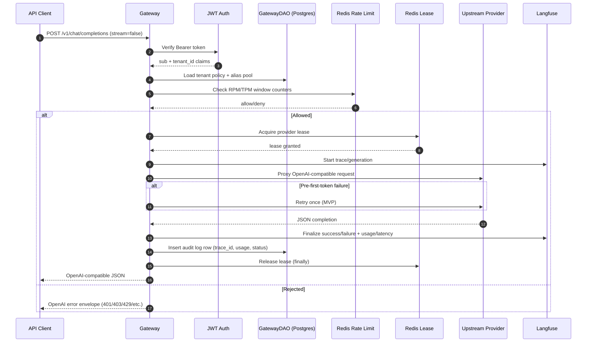
```mermaid
sequenceDiagram
    autonumber
    participant C as API Client
    participant GW as Gateway
    participant AUTH as JWT Auth
    participant DAO as GatewayDAO (Postgres)
    participant RL as Redis Rate Limit
    participant LEASE as Redis Lease
    participant UP as Upstream Provider
    participant OBS as Langfuse

    C->>GW: POST /v1/chat/completions (stream=false)
    GW->>AUTH: Verify Bearer token
    AUTH-->>GW: sub + tenant_id claims
    GW->>DAO: Load tenant policy + alias pool
    GW->>RL: Check RPM/TPM window counters
    RL-->>GW: allow/deny
    alt Allowed
      GW->>LEASE: Acquire provider lease
      LEASE-->>GW: lease granted
      GW->>OBS: Start trace/generation
      GW->>UP: Proxy OpenAI-compatible request
      alt Pre-first-token failure
        GW->>UP: Retry once (MVP)
      end
      UP-->>GW: JSON completion
      GW->>OBS: Finalize success/failure + usage/latency
      GW->>DAO: Insert audit log row (trace_id, usage, status)
      GW->>LEASE: Release lease (finally)
      GW-->>C: OpenAI-compatible JSON
    else Rejected
      GW-->>C: OpenAI error envelope (401/403/429/etc.)
    end
```

## 3. Chat Completions (SSE-Streaming)

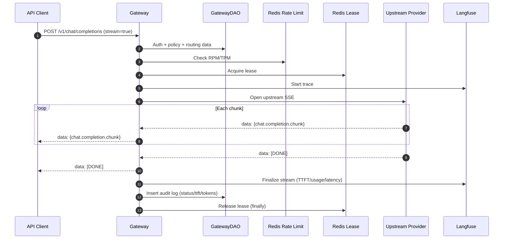
```mermaid
sequenceDiagram
    autonumber
    participant C as API Client
    participant GW as Gateway
    participant DAO as GatewayDAO
    participant RL as Redis Rate Limit
    participant LEASE as Redis Lease
    participant UP as Upstream Provider
    participant OBS as Langfuse

    C->>GW: POST /v1/chat/completions (stream=true)
    GW->>DAO: Auth + policy + routing data
    GW->>RL: Check RPM/TPM
    GW->>LEASE: Acquire lease
    GW->>OBS: Start trace
    GW->>UP: Open upstream SSE
    loop Each chunk
      UP-->>GW: data: {chat.completion.chunk}
      GW-->>C: data: {chat.completion.chunk}
    end
    UP-->>GW: data: [DONE]
    GW-->>C: data: [DONE]
    GW->>OBS: Finalize stream (TTFT/usage/latency)
    GW->>DAO: Insert audit log (status/ttft/tokens)
    GW->>LEASE: Release lease (finally)
```

## 4. Embeddings

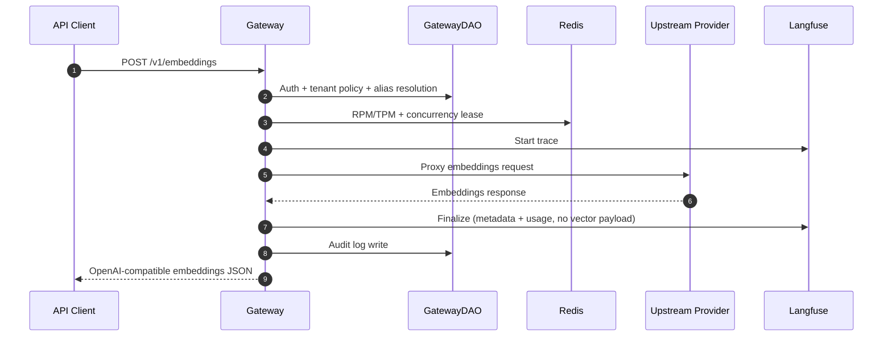
```mermaid
sequenceDiagram
    autonumber
    participant C as API Client
    participant GW as Gateway
    participant DAO as GatewayDAO
    participant R as Redis
    participant UP as Upstream Provider
    participant OBS as Langfuse

    C->>GW: POST /v1/embeddings
    GW->>DAO: Auth + tenant policy + alias resolution
    GW->>R: RPM/TPM + concurrency lease
    GW->>OBS: Start trace
    GW->>UP: Proxy embeddings request
    UP-->>GW: Embeddings response
    GW->>OBS: Finalize (metadata + usage, no vector payload)
    GW->>DAO: Audit log write
    GW-->>C: OpenAI-compatible embeddings JSON
```

## 5. LLM-Topologie & Live-Traces

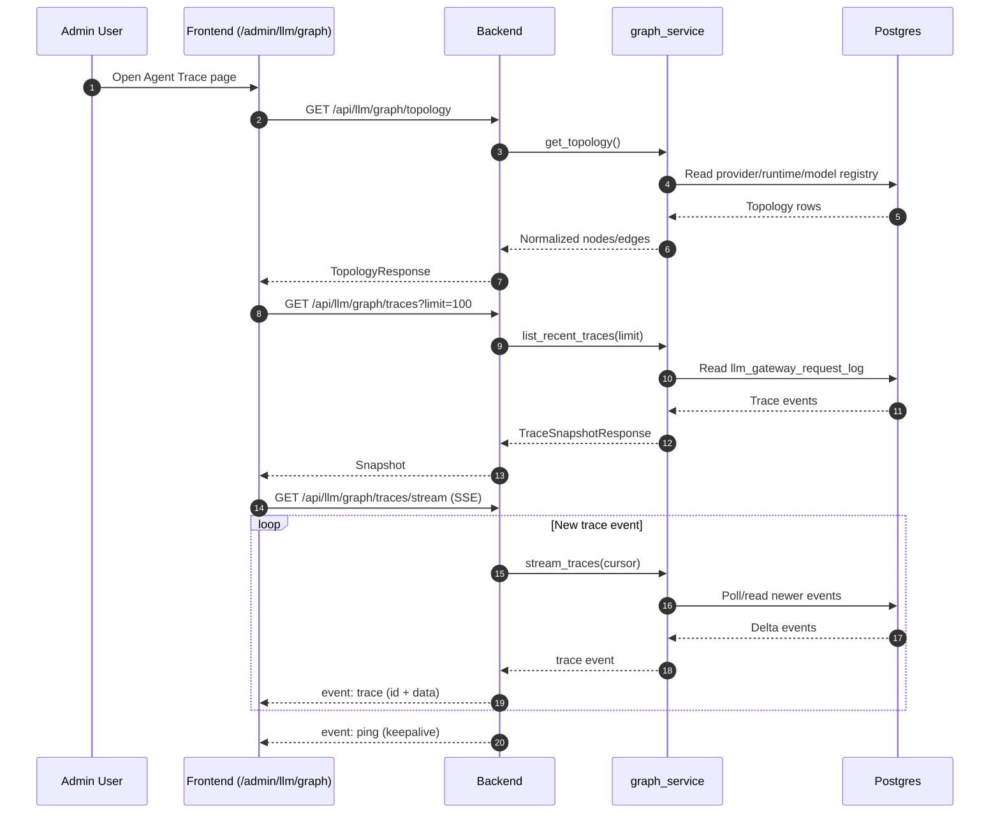
```mermaid
sequenceDiagram
    autonumber
    participant U as Admin User
    participant FE as Frontend (/admin/llm/graph)
    participant BE as Backend
    participant SVC as graph_service
    participant PG as Postgres

    U->>FE: Open Agent Trace page
    FE->>BE: GET /api/llm/graph/topology
    BE->>SVC: get_topology()
    SVC->>PG: Read provider/runtime/model registry
    PG-->>SVC: Topology rows
    SVC-->>BE: Normalized nodes/edges
    BE-->>FE: TopologyResponse

    FE->>BE: GET /api/llm/graph/traces?limit=100
    BE->>SVC: list_recent_traces(limit)
    SVC->>PG: Read llm_gateway_request_log
    PG-->>SVC: Trace events
    SVC-->>BE: TraceSnapshotResponse
    BE-->>FE: Snapshot

    FE->>BE: GET /api/llm/graph/traces/stream (SSE)
    loop New trace event
      BE->>SVC: stream_traces(cursor)
      SVC->>PG: Poll/read newer events
      PG-->>SVC: Delta events
      SVC-->>BE: trace event
      BE-->>FE: event: trace (id + data)
    end
    BE-->>FE: event: ping (keepalive)
```

## 6. Container-Management

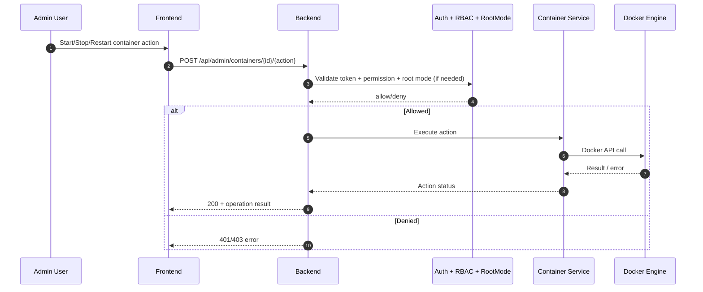
```mermaid
sequenceDiagram
    autonumber
    participant U as Admin User
    participant FE as Frontend
    participant BE as Backend
    participant RBAC as Auth + RBAC + RootMode
    participant OPS as Container Service
    participant DE as Docker Engine

    U->>FE: Start/Stop/Restart container action
    FE->>BE: POST /api/admin/containers/{id}/{action}
    BE->>RBAC: Validate token + permission + root mode (if needed)
    RBAC-->>BE: allow/deny
    alt Allowed
      BE->>OPS: Execute action
      OPS->>DE: Docker API call
      DE-->>OPS: Result / error
      OPS-->>BE: Action status
      BE-->>FE: 200 + operation result
    else Denied
      BE-->>FE: 401/403 error
    end
```

## 7. Systemeinstellungen (Anwenden)

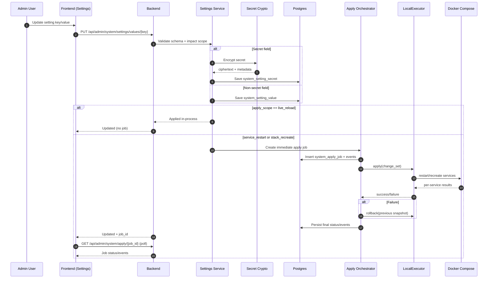
```mermaid
sequenceDiagram
    autonumber
    participant U as Admin User
    participant FE as Frontend (Settings)
    participant BE as Backend
    participant SET as Settings Service
    participant ENC as Secret Crypto
    participant DB as Postgres
    participant APPLY as Apply Orchestrator
    participant EXEC as LocalExecutor
    participant DE as Docker Compose

    U->>FE: Update setting key/value
    FE->>BE: PUT /api/admin/system/settings/values/{key}
    BE->>SET: Validate schema + impact scope
    alt Secret field
      SET->>ENC: Encrypt secret
      ENC-->>SET: ciphertext + metadata
      SET->>DB: Save system_setting_secret
    else Non-secret field
      SET->>DB: Save system_setting_value
    end

    alt apply_scope == live_reload
      SET-->>BE: Applied in-process
      BE-->>FE: Updated (no job)
    else service_restart or stack_recreate
      SET->>APPLY: Create immediate apply job
      APPLY->>DB: Insert system_apply_job + events
      APPLY->>EXEC: apply(change_set)
      EXEC->>DE: restart/recreate services
      DE-->>EXEC: per-service results
      EXEC-->>APPLY: success/failure
      alt Failure
        APPLY->>EXEC: rollback(previous snapshot)
      end
      APPLY->>DB: Persist final status/events
      BE-->>FE: Updated + job_id
      FE->>BE: GET /api/admin/system/apply/{job_id} (poll)
      BE-->>FE: Job status/events
    end
```

## 8. Init-Assistent

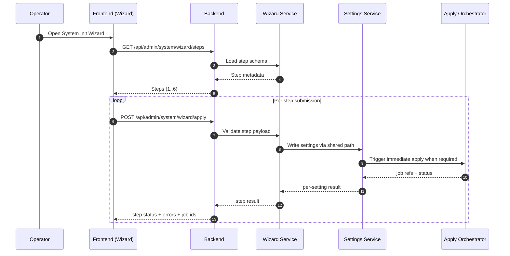
```mermaid
sequenceDiagram
    autonumber
    participant U as Operator
    participant FE as Frontend (Wizard)
    participant BE as Backend
    participant WIZ as Wizard Service
    participant SET as Settings Service
    participant APPLY as Apply Orchestrator

    U->>FE: Open System Init Wizard
    FE->>BE: GET /api/admin/system/wizard/steps
    BE->>WIZ: Load step schema
    WIZ-->>BE: Step metadata
    BE-->>FE: Steps (1..6)

    loop Per step submission
      FE->>BE: POST /api/admin/system/wizard/apply
      BE->>WIZ: Validate step payload
      WIZ->>SET: Write settings via shared path
      SET->>APPLY: Trigger immediate apply when required
      APPLY-->>SET: job refs + status
      SET-->>WIZ: per-setting result
      WIZ-->>BE: step result
      BE-->>FE: step status + errors + job ids
    end
```

## 9. Multi-Host-Agent

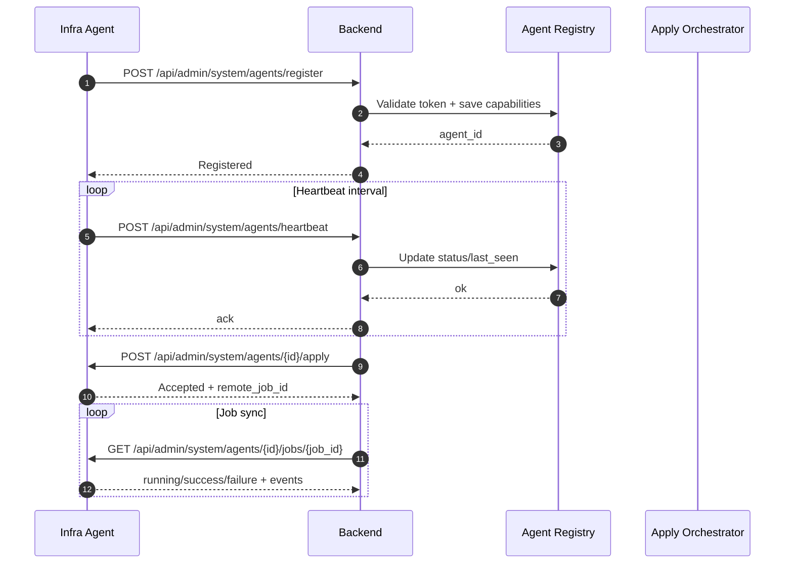
```mermaid
sequenceDiagram
    autonumber
    participant AG as Infra Agent
    participant BE as Backend
    participant REG as Agent Registry
    participant APPLY as Apply Orchestrator

    AG->>BE: POST /api/admin/system/agents/register
    BE->>REG: Validate token + save capabilities
    REG-->>BE: agent_id
    BE-->>AG: Registered

    loop Heartbeat interval
      AG->>BE: POST /api/admin/system/agents/heartbeat
      BE->>REG: Update status/last_seen
      REG-->>BE: ok
      BE-->>AG: ack
    end

    BE->>AG: POST /api/admin/system/agents/{id}/apply
    AG-->>BE: Accepted + remote_job_id
    loop Job sync
      BE->>AG: GET /api/admin/system/agents/{id}/jobs/{job_id}
      AG-->>BE: running/success/failure + events
    end
```

## 10. Logging & Observability

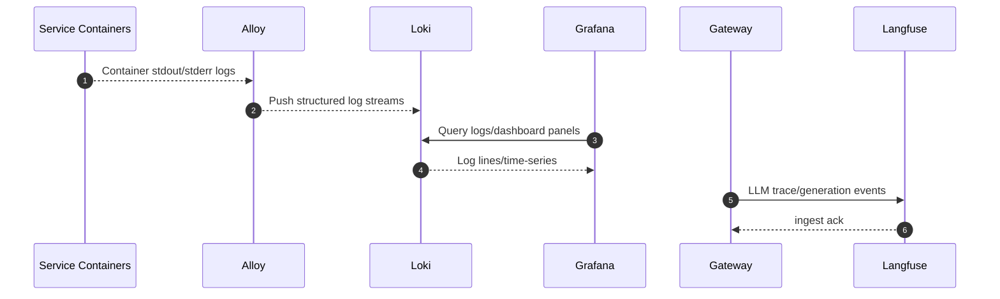
```mermaid
sequenceDiagram
    autonumber
    participant APP as Service Containers
    participant AL as Alloy
    participant LK as Loki
    participant GF as Grafana
    participant GW as Gateway
    participant LF as Langfuse

    APP-->>AL: Container stdout/stderr logs
    AL-->>LK: Push structured log streams
    GF->>LK: Query logs/dashboard panels
    LK-->>GF: Log lines/time-series

    GW->>LF: LLM trace/generation events
    LF-->>GW: ingest ack
```

## 11. RAG-Suche

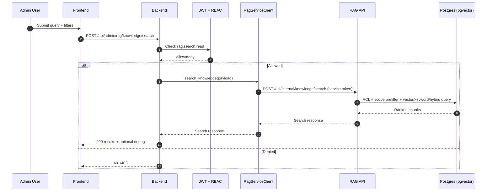
```mermaid
sequenceDiagram
    autonumber
    participant U as Admin User
    participant FE as Frontend
    participant BE as Backend
    participant RBAC as JWT + RBAC
    participant RC as RagServiceClient
    participant RAG as RAG API
    participant DB as Postgres (pgvector)

    U->>FE: Submit query + filters
    FE->>BE: POST /api/admin/rag/knowledge/search
    BE->>RBAC: Check rag.search:read
    RBAC-->>BE: allow/deny
    alt Allowed
      BE->>RC: search_knowledge(payload)
      RC->>RAG: POST /api/internal/knowledge/search (service token)
      RAG->>DB: ACL + scope prefilter + vector/keyword/hybrid query
      DB-->>RAG: Ranked chunks
      RAG-->>RC: Search response
      RC-->>BE: Search response
      BE-->>FE: 200 results + optional debug
    else Denied
      BE-->>FE: 401/403
    end
```

## 12. RAG-Upload & Veröffentlichung

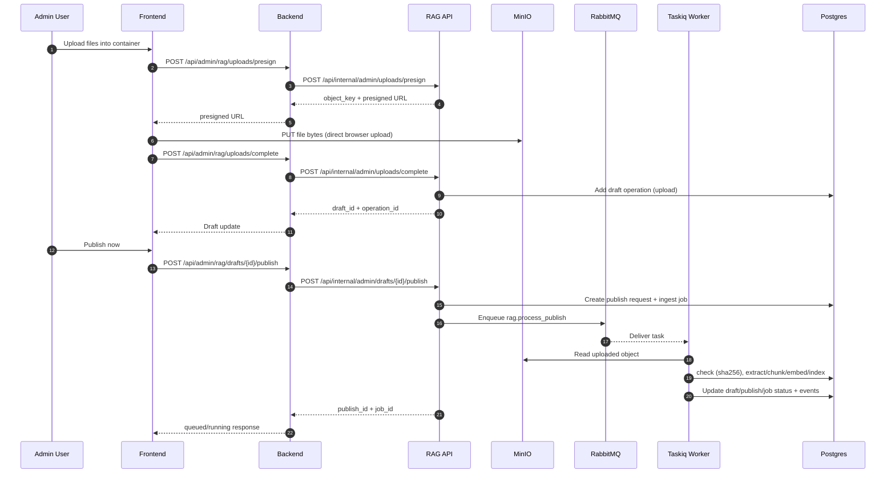
```mermaid
sequenceDiagram
    autonumber
    participant U as Admin User
    participant FE as Frontend
    participant BE as Backend
    participant RAG as RAG API
    participant MIO as MinIO
    participant RMQ as RabbitMQ
    participant W as Taskiq Worker
    participant DB as Postgres

    U->>FE: Upload files into container
    FE->>BE: POST /api/admin/rag/uploads/presign
    BE->>RAG: POST /api/internal/admin/uploads/presign
    RAG-->>BE: object_key + presigned URL
    BE-->>FE: presigned URL
    FE->>MIO: PUT file bytes (direct browser upload)
    FE->>BE: POST /api/admin/rag/uploads/complete
    BE->>RAG: POST /api/internal/admin/uploads/complete
    RAG->>DB: Add draft operation (upload)
    RAG-->>BE: draft_id + operation_id
    BE-->>FE: Draft update

    U->>FE: Publish now
    FE->>BE: POST /api/admin/rag/drafts/{id}/publish
    BE->>RAG: POST /api/internal/admin/drafts/{id}/publish
    RAG->>DB: Create publish request + ingest job
    RAG->>RMQ: Enqueue rag.process_publish
    RMQ-->>W: Deliver task
    W->>MIO: Read uploaded object
    W->>DB: check (sha256), extract/chunk/embed/index
    W->>DB: Update draft/publish/job status + events
    RAG-->>BE: publish_id + job_id
    BE-->>FE: queued/running response
```

## 13. Geplante Veröffentlichung

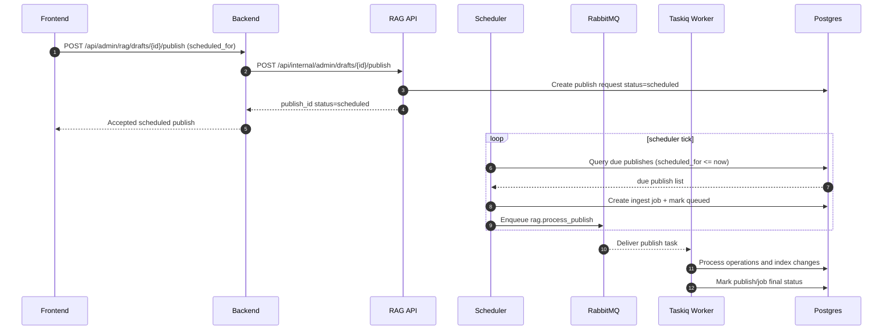
```mermaid
sequenceDiagram
    autonumber
    participant FE as Frontend
    participant BE as Backend
    participant RAG as RAG API
    participant S as Scheduler
    participant RMQ as RabbitMQ
    participant W as Taskiq Worker
    participant DB as Postgres

    FE->>BE: POST /api/admin/rag/drafts/{id}/publish (scheduled_for)
    BE->>RAG: POST /api/internal/admin/drafts/{id}/publish
    RAG->>DB: Create publish request status=scheduled
    RAG-->>BE: publish_id status=scheduled
    BE-->>FE: Accepted scheduled publish

    loop scheduler tick
      S->>DB: Query due publishes (scheduled_for <= now)
      DB-->>S: due publish list
      S->>DB: Create ingest job + mark queued
      S->>RMQ: Enqueue rag.process_publish
    end

    RMQ-->>W: Deliver publish task
    W->>DB: Process operations and index changes
    W->>DB: Mark publish/job final status
```

## 14. Konsolen-Chat-Completions

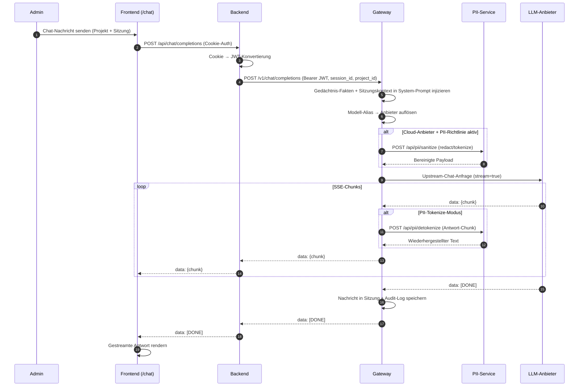
```mermaid
sequenceDiagram
    autonumber
    participant U as Admin
    participant FE as Frontend (/chat)
    participant BE as Backend
    participant GW as Gateway
    participant PII as PII-Service
    participant LP as LLM-Anbieter

    U->>FE: Chat-Nachricht senden (Projekt + Sitzung)
    FE->>BE: POST /api/chat/completions (Cookie-Auth)
    BE->>BE: Cookie → JWT-Konvertierung
    BE->>GW: POST /v1/chat/completions (Bearer JWT, session_id, project_id)
    GW->>GW: Gedächtnis-Fakten + Sitzungskontext in System-Prompt injizieren
    GW->>GW: Modell-Alias → Anbieter auflösen
    alt Cloud-Anbieter + PII-Richtlinie aktiv
      GW->>PII: POST /api/pii/sanitize (redact/tokenize)
      PII-->>GW: Bereinigte Payload
    end
    GW->>LP: Upstream-Chat-Anfrage (stream=true)
    loop SSE-Chunks
      LP-->>GW: data: {chunk}
      alt PII-Tokenize-Modus
        GW->>PII: POST /api/pii/detokenize (Antwort-Chunk)
        PII-->>GW: Wiederhergestellter Text
      end
      GW-->>BE: data: {chunk}
      BE-->>FE: data: {chunk}
    end
    LP-->>GW: data: [DONE]
    GW->>GW: Nachricht in Sitzung + Audit-Log speichern
    GW-->>BE: data: [DONE]
    BE-->>FE: data: [DONE]
    FE->>FE: Gestreamte Antwort rendern
```

## 15. Sitzungs- & Gedächtnis-Lebenszyklus

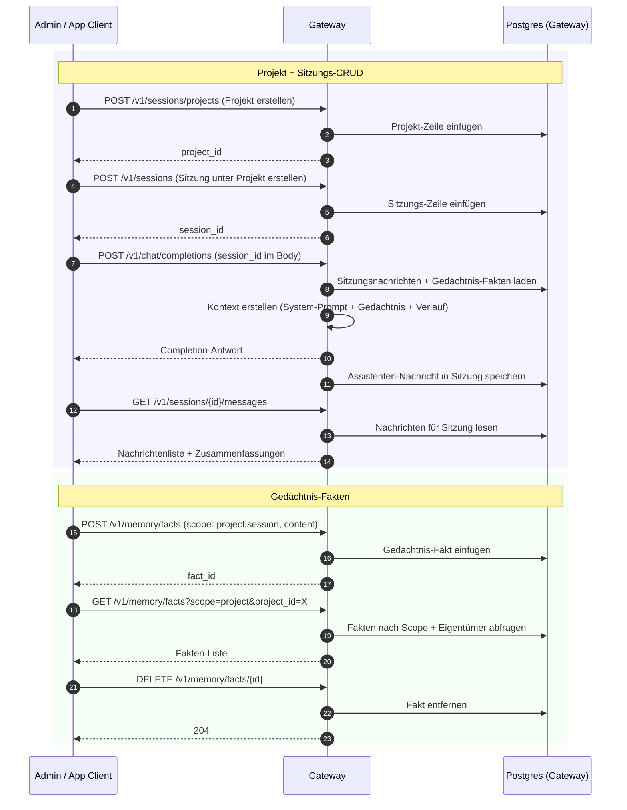
```mermaid
sequenceDiagram
    autonumber
    participant U as Admin / App Client
    participant GW as Gateway
    participant DB as Postgres (Gateway)

    rect rgb(245,245,255)
    Note over U,DB: Projekt + Sitzungs-CRUD
    U->>GW: POST /v1/sessions/projects (Projekt erstellen)
    GW->>DB: Projekt-Zeile einfügen
    GW-->>U: project_id

    U->>GW: POST /v1/sessions (Sitzung unter Projekt erstellen)
    GW->>DB: Sitzungs-Zeile einfügen
    GW-->>U: session_id

    U->>GW: POST /v1/chat/completions (session_id im Body)
    GW->>DB: Sitzungsnachrichten + Gedächtnis-Fakten laden
    GW->>GW: Kontext erstellen (System-Prompt + Gedächtnis + Verlauf)
    GW-->>U: Completion-Antwort
    GW->>DB: Assistenten-Nachricht in Sitzung speichern

    U->>GW: GET /v1/sessions/{id}/messages
    GW->>DB: Nachrichten für Sitzung lesen
    GW-->>U: Nachrichtenliste + Zusammenfassungen
    end

    rect rgb(245,255,245)
    Note over U,DB: Gedächtnis-Fakten
    U->>GW: POST /v1/memory/facts (scope: project|session, content)
    GW->>DB: Gedächtnis-Fakt einfügen
    GW-->>U: fact_id

    U->>GW: GET /v1/memory/facts?scope=project&project_id=X
    GW->>DB: Fakten nach Scope + Eigentümer abfragen
    GW-->>U: Fakten-Liste

    U->>GW: DELETE /v1/memory/facts/{id}
    GW->>DB: Fakt entfernen
    GW-->>U: 204
    end
```

## 16. Dateianhang-Upload & Extraktion

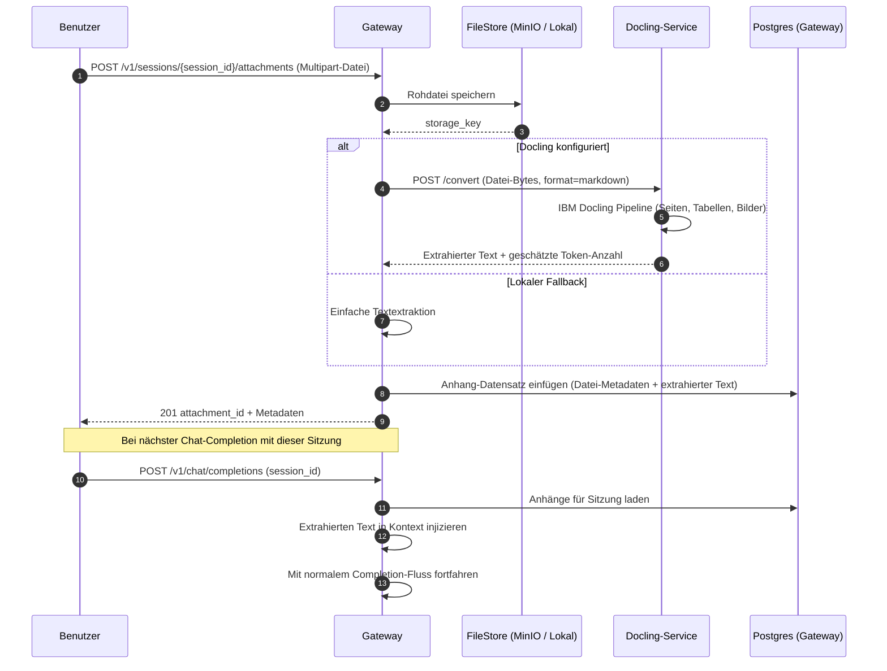
```mermaid
sequenceDiagram
    autonumber
    participant U as Benutzer
    participant GW as Gateway
    participant FS as FileStore (MinIO / Lokal)
    participant DOC as Docling-Service
    participant DB as Postgres (Gateway)

    U->>GW: POST /v1/sessions/{session_id}/attachments (Multipart-Datei)
    GW->>FS: Rohdatei speichern
    FS-->>GW: storage_key

    alt Docling konfiguriert
      GW->>DOC: POST /convert (Datei-Bytes, format=markdown)
      DOC->>DOC: IBM Docling Pipeline (Seiten, Tabellen, Bilder)
      DOC-->>GW: Extrahierter Text + geschätzte Token-Anzahl
    else Lokaler Fallback
      GW->>GW: Einfache Textextraktion
    end

    GW->>DB: Anhang-Datensatz einfügen (Datei-Metadaten + extrahierter Text)
    GW-->>U: 201 attachment_id + Metadaten

    Note over U,GW: Bei nächster Chat-Completion mit dieser Sitzung
    U->>GW: POST /v1/chat/completions (session_id)
    GW->>DB: Anhänge für Sitzung laden
    GW->>GW: Extrahierten Text in Kontext injizieren
    GW->>GW: Mit normalem Completion-Fluss fortfahren
```

## 17. PII-Screening-Pipeline

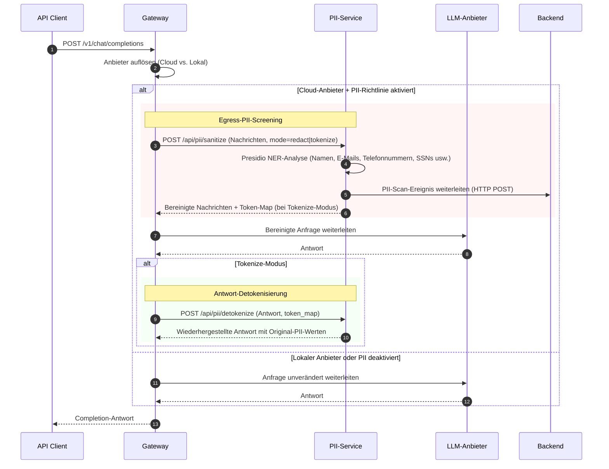
```mermaid
sequenceDiagram
    autonumber
    participant C as API Client
    participant GW as Gateway
    participant PII as PII-Service
    participant LP as LLM-Anbieter
    participant BE as Backend

    C->>GW: POST /v1/chat/completions
    GW->>GW: Anbieter auflösen (Cloud vs. Lokal)

    alt Cloud-Anbieter + PII-Richtlinie aktiviert
      rect rgb(255,245,245)
      Note over GW,PII: Egress-PII-Screening
      GW->>PII: POST /api/pii/sanitize (Nachrichten, mode=redact|tokenize)
      PII->>PII: Presidio NER-Analyse (Namen, E-Mails, Telefonnummern, SSNs usw.)
      PII->>BE: PII-Scan-Ereignis weiterleiten (HTTP POST)
      PII-->>GW: Bereinigte Nachrichten + Token-Map (bei Tokenize-Modus)
      end

      GW->>LP: Bereinigte Anfrage weiterleiten
      LP-->>GW: Antwort

      alt Tokenize-Modus
        rect rgb(245,255,245)
        Note over GW,PII: Antwort-Detokenisierung
        GW->>PII: POST /api/pii/detokenize (Antwort, token_map)
        PII-->>GW: Wiederhergestellte Antwort mit Original-PII-Werten
        end
      end
    else Lokaler Anbieter oder PII deaktiviert
      GW->>LP: Anfrage unverändert weiterleiten
      LP-->>GW: Antwort
    end

    GW-->>C: Completion-Antwort
```

## 18. SSO-Authentifizierungsablauf

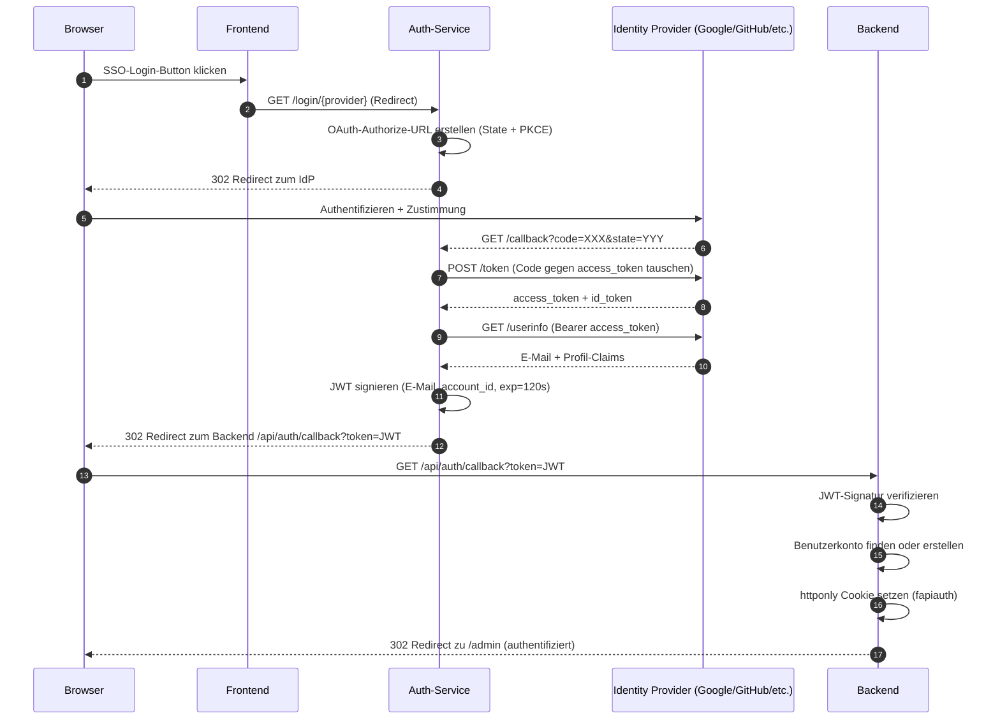
```mermaid
sequenceDiagram
    autonumber
    participant U as Browser
    participant FE as Frontend
    participant AUTH as Auth-Service
    participant IDP as Identity Provider (Google/GitHub/etc.)
    participant BE as Backend

    U->>FE: SSO-Login-Button klicken
    FE->>AUTH: GET /login/{provider} (Redirect)
    AUTH->>AUTH: OAuth-Authorize-URL erstellen (State + PKCE)
    AUTH-->>U: 302 Redirect zum IdP

    U->>IDP: Authentifizieren + Zustimmung
    IDP-->>AUTH: GET /callback?code=XXX&state=YYY

    AUTH->>IDP: POST /token (Code gegen access_token tauschen)
    IDP-->>AUTH: access_token + id_token

    AUTH->>IDP: GET /userinfo (Bearer access_token)
    IDP-->>AUTH: E-Mail + Profil-Claims

    AUTH->>AUTH: JWT signieren (E-Mail, account_id, exp=120s)
    AUTH-->>U: 302 Redirect zum Backend /api/auth/callback?token=JWT

    U->>BE: GET /api/auth/callback?token=JWT
    BE->>BE: JWT-Signatur verifizieren
    BE->>BE: Benutzerkonto finden oder erstellen
    BE->>BE: httponly Cookie setzen (fapiauth)
    BE-->>U: 302 Redirect zu /admin (authentifiziert)
```

## 19. Benachrichtigungs-Zustellungs-Pipeline

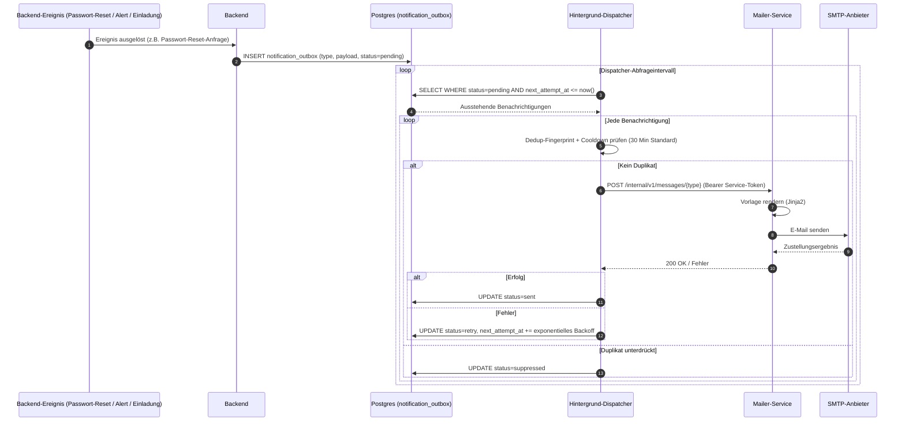
```mermaid
sequenceDiagram
    autonumber
    participant TRIGGER as Backend-Ereignis (Passwort-Reset / Alert / Einladung)
    participant BE as Backend
    participant DB as Postgres (notification_outbox)
    participant DISP as Hintergrund-Dispatcher
    participant MAILER as Mailer-Service
    participant SMTP as SMTP-Anbieter

    TRIGGER->>BE: Ereignis ausgelöst (z.B. Passwort-Reset-Anfrage)
    BE->>DB: INSERT notification_outbox (type, payload, status=pending)

    loop Dispatcher-Abfrageintervall
      DISP->>DB: SELECT WHERE status=pending AND next_attempt_at <= now()
      DB-->>DISP: Ausstehende Benachrichtigungen

      loop Jede Benachrichtigung
        DISP->>DISP: Dedup-Fingerprint + Cooldown prüfen (30 Min Standard)
        alt Kein Duplikat
          DISP->>MAILER: POST /internal/v1/messages/{type} (Bearer Service-Token)
          MAILER->>MAILER: Vorlage rendern (Jinja2)
          MAILER->>SMTP: E-Mail senden
          SMTP-->>MAILER: Zustellungsergebnis
          MAILER-->>DISP: 200 OK / Fehler

          alt Erfolg
            DISP->>DB: UPDATE status=sent
          else Fehler
            DISP->>DB: UPDATE status=retry, next_attempt_at += exponentielles Backoff
          end
        else Duplikat unterdrückt
          DISP->>DB: UPDATE status=suppressed
        end
      end
    end
```

## 20. Modul-Aktivierung / -Deaktivierung

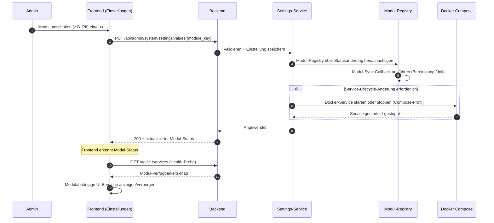
```mermaid
sequenceDiagram
    autonumber
    participant U as Admin
    participant FE as Frontend (Einstellungen)
    participant BE as Backend
    participant SET as Settings-Service
    participant REG as Modul-Registry
    participant DE as Docker Compose

    U->>FE: Modul umschalten (z.B. PII) ein/aus
    FE->>BE: PUT /api/admin/system/settings/values/{module_key}
    BE->>SET: Validieren + Einstellung speichern

    SET->>REG: Modul-Registry über Statusänderung benachrichtigen
    REG->>REG: Modul-Sync-Callback ausführen (Bereinigung / Init)

    alt Service-Lifecycle-Änderung erforderlich
      SET->>DE: Docker-Service starten oder stoppen (Compose-Profil)
      DE-->>SET: Service gestartet / gestoppt
    end

    SET-->>BE: Angewendet
    BE-->>FE: 200 + aktualisierter Modul-Status

    Note over FE: Frontend erkennt Modul-Status
    FE->>BE: GET /api/v1/services (Health-Probe)
    BE-->>FE: Modul-Verfügbarkeits-Map
    FE->>FE: Modulabhängige UI-Bereiche anzeigen/verbergen
```
