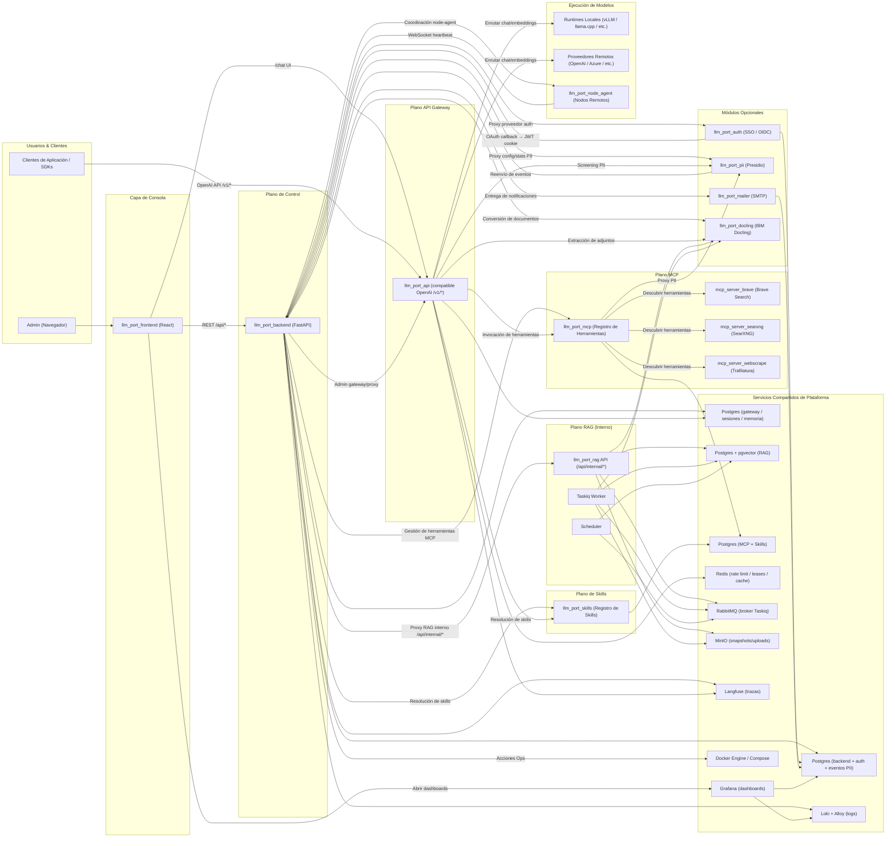

# Arquitectura

Esta página describe la arquitectura de alto nivel de **llm.Port** — los planos, servicios y flujos de datos que componen la plataforma.

## Visión General de la Plataforma

## Planos

### Capa de Consola

El **frontend React** proporciona la consola de administración — una SPA para gestionar proveedores, modelos, contenedores, RAG, políticas PII y ajustes del sistema.

### Plano de Control

El **backend FastAPI** es el orquestador central. Gestiona:

- Gestión de usuarios, RBAC y autenticación
- Configuración de proveedores LLM y runtimes
- Gestión del ciclo de vida de contenedores vía Docker API
- Ajustes del sistema con criptografía y orquestación de aplicación
- Proxy de solicitudes internas a RAG y al gateway

### Plano API Gateway

El **gateway** expone una API compatible con OpenAI (`/v1/models`, `/v1/chat/completions`, `/v1/embeddings`). Gestiona:

- Resolución de modelos por alias y enrutamiento a proveedores
- Autenticación JWT con claims por tenant
- Rate limiting y concurrency leasing basados en Redis
- Streaming SSE con extracción de TTFT
- Trazado Langfuse y registro de auditoría
- Sesiones de chat, hechos de memoria y archivos adjuntos
- Screening PII a través del módulo PII

### Módulos Opcionales

Servicios separados que se pueden habilitar o deshabilitar vía perfiles de Docker Compose:

- **Auth** — Autenticación SSO / OIDC con adaptadores de proveedores OAuth
- **PII** — Escaneo PII basado en Presidio, redacción y tokenización
- **Mailer** — Notificaciones por correo con plantillas Jinja2
- **Docling** — Procesamiento de documentos basado en IBM Docling para extracción de texto

### Plano MCP

El **registro de herramientas MCP** (`llm_port_mcp`) es un broker gobernado para servidores de herramientas del Model Context Protocol:

- Registra servidores MCP-compatibles (transportes stdio, SSE y Streamable HTTP)
- Descubre automáticamente herramientas y las convierte en definiciones de herramientas compatibles con OpenAI
- Enruta todas las invocaciones a través de un **Privacy Proxy** (detección PII basada en Presidio)
- Cifra credenciales de servidor con Fernet

Servidores MCP integrados: **Brave Search**, **SearXNG** (autoalojado, sin API key) y **Web Scrape** (extracción de contenido basada en Trafilatura).

### Plano de Skills

El **registro de Skills** (`llm_port_skills`) gestiona playbooks de razonamiento reutilizables. Los skills son documentos Markdown con frontmatter YAML que determinan cómo el sistema razona sobre clases de solicitudes — entre contexto RAG, herramientas MCP y composición de prompts.

### Agente de Nodo

El **Agente de Nodo** (`llm_port_node_agent`) es un binario ligero del lado del host para despliegues multi-nodo:

- Registro con el backend usando un token de un solo uso
- Conexión WebSocket autenticada para heartbeats y despacho de comandos
- Ejecución de comandos del ciclo de vida de Docker en nodos remotos
- Envío de logs a Loki (journald en Linux, Event Log en Windows)
- Distribución como binarios independientes (sin Python requerido en el nodo)

### Plano RAG

El **subsistema RAG** es un servicio interno accesible solo a través del backend. Gestiona:

- Ingesta de documentos: subir → extraer → trocear → embeber → indexar
- Búsqueda de conocimiento: scoring vectorial, por palabras clave e híbrido con ACL
- Contenedores virtuales con flujos de trabajo borrador/publicación
- Procesamiento asíncrono via Taskiq + RabbitMQ

### Servicios Compartidos de Plataforma

Contenedores de infraestructura gestionados vía Docker Compose:

| Servicio      | Propósito                                                                                              |
| ------------- | ------------------------------------------------------------------------------------------------------ |
| PostgreSQL    | Backend + metadatos auth + eventos PII, sesiones/memoria del gateway, vectores RAG, datos MCP + skills |
| Redis         | Rate limiting, concurrency leases, caché                                                               |
| RabbitMQ      | Broker de tareas asíncronas (Taskiq)                                                                   |
| MinIO         | Almacenamiento de objetos para uploads y snapshots                                                     |
| Langfuse      | Almacenamiento de trazas LLM y eventos de generación                                                   |
| Loki + Alloy  | Recopilación y consulta centralizada de logs                                                           |
| Grafana       | Dashboard y visualización                                                                              |
| Docker Engine | Orquestación de contenedores para runtimes                                                             |

## Rutas de Llamada

1. **Operaciones de admin** — `Navegador → Frontend → Backend → Docker / Settings / Proxy targets`
2. **Inferencia de aplicaciones** — `App/SDK → Gateway → runtime local o proveedor remoto → respuesta`
3. **Chat completions (consola)** — `Navegador → Frontend → Backend (cookie→JWT proxy) → Gateway /v1/chat/completions → proveedor → respuesta SSE`
4. **Consulta RAG** — `Frontend → Backend /api/admin/rag/* → RAG /api/internal/knowledge/search`
5. **Publicación RAG** — `Subida → MinIO → RabbitMQ → Worker → extracción Docling → trocear → embeber → índice pgvector`
6. **Screening PII** — `Gateway (middleware pre-forward) → PII /analyze → redactar/marcar → continuar o rechazar`
7. **Autenticación SSO** — `Navegador → Auth /login/<provider> → IdP → Auth /callback → JWT firmado → Backend (establecer cookie)`
8. **Entrega de notificaciones** — `Backend (escritura outbox) → dispatcher → Mailer /send → proveedor SMTP`
9. **Procesamiento de documentos** — `Subida de archivo → Docling /convert → pipeline IBM Docling → texto estructurado → llamador (worker RAG / gateway)`
10. **Observabilidad** — `Backend + Gateway + RAG → Loki / Langfuse → dashboards Grafana`
11. **Invocación de herramientas MCP** — `Gateway → MCP Hub → Privacy Proxy (escaneo PII) → Servidor MCP → resultado → Gateway`
12. **Resolución de skills** — `Gateway (pre-prompt) → Skills /resolve → playbooks coincidentes → composición de prompt`
13. **Despacho de agente de nodo** — `Backend → WebSocket → Agente de Nodo → comando de ciclo de vida Docker → informe de estado`

Para diagramas de secuencia detallados de cada flujo, consulta [Secuencias de Llamada](/docs/call-sequences).
