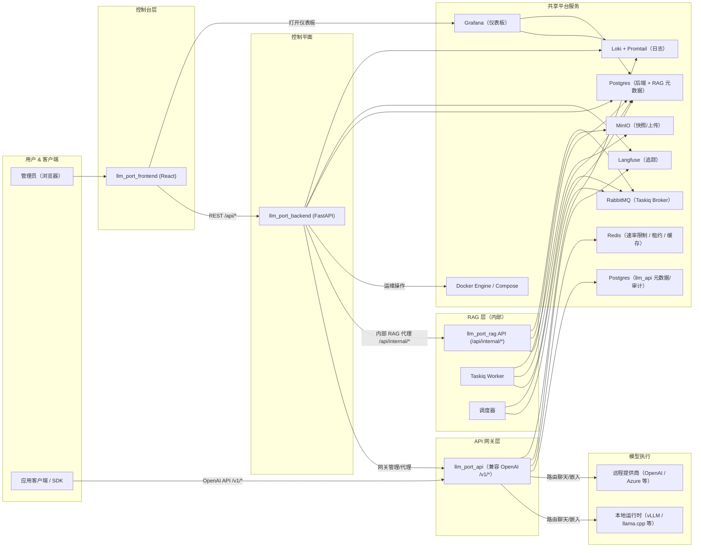

# 架构

本页介绍 **llm.Port** 的高层架构——平台的各个层面、服务和数据流。

## 平台概览

## 各层说明

### 控制台层

**React 前端**提供管理控制台——一个用于管理提供商、模型、容器、RAG、PII 策略和系统设置的单页应用。

### 控制平面

**FastAPI 后端**是中枢协调器，负责：

- 用户管理、RBAC 和认证
- LLM 提供商和运行时配置
- 通过 Docker API 进行容器生命周期管理
- 系统设置（含加密和应用编排）
- 代理内部请求至 RAG 和网关

### API 网关层

**网关**暴露兼容 OpenAI 的 API（`/v1/models`、`/v1/chat/completions`、`/v1/embeddings`），处理：

- 基于别名的模型解析和提供商路由
- 带租户感知声明的 JWT 认证
- 基于 Redis 的速率限制和并发租约
- 带 TTFT 提取的 SSE 流式传输
- Langfuse 追踪和审计日志

### RAG 层

**RAG 子系统**是只能通过后端访问的内部服务，管理：

- 文档摄取：上传 → 提取 → 分块 → 嵌入 → 索引
- 知识检索：向量、关键词和混合评分（含 ACL 执行）
- 支持草稿/发布工作流的虚拟容器
- 通过 Taskiq + RabbitMQ 的异步处理

### 共享平台服务

通过 Docker Compose 管理的基础设施容器：

| 服务          | 用途                                       |
| ------------- | ------------------------------------------ |
| PostgreSQL    | 后端元数据、RAG 向量（pgvector）、网关审计 |
| Redis         | 速率限制、并发租约、缓存                   |
| RabbitMQ      | 异步任务代理（Taskiq）                     |
| MinIO         | 上传和快照的对象存储                       |
| Langfuse      | LLM 追踪和生成事件存储                     |
| Loki + Alloy  | 集中式日志收集和查询                       |
| Grafana       | 仪表板和可视化                             |
| Docker Engine | 运行时的容器编排                           |

## 调用路径

1. **管理员操作** — `浏览器 → 前端 → 后端 → Docker / 设置 / 代理目标`
2. **应用推理** — `应用/SDK → 网关 → 本地运行时或远程提供商 → 响应`
3. **RAG 查询** — `前端 → 后端 /api/admin/rag/* → RAG /api/internal/knowledge/search`
4. **RAG 发布** — `上传 → MinIO → RabbitMQ → Worker → 提取/分块/嵌入/索引`
5. **可观测性** — `后端 + 网关 + RAG → Loki / Langfuse → Grafana 仪表板`

有关每个流的详细序列图，请参阅[调用序列](/docs/call-sequences)。
