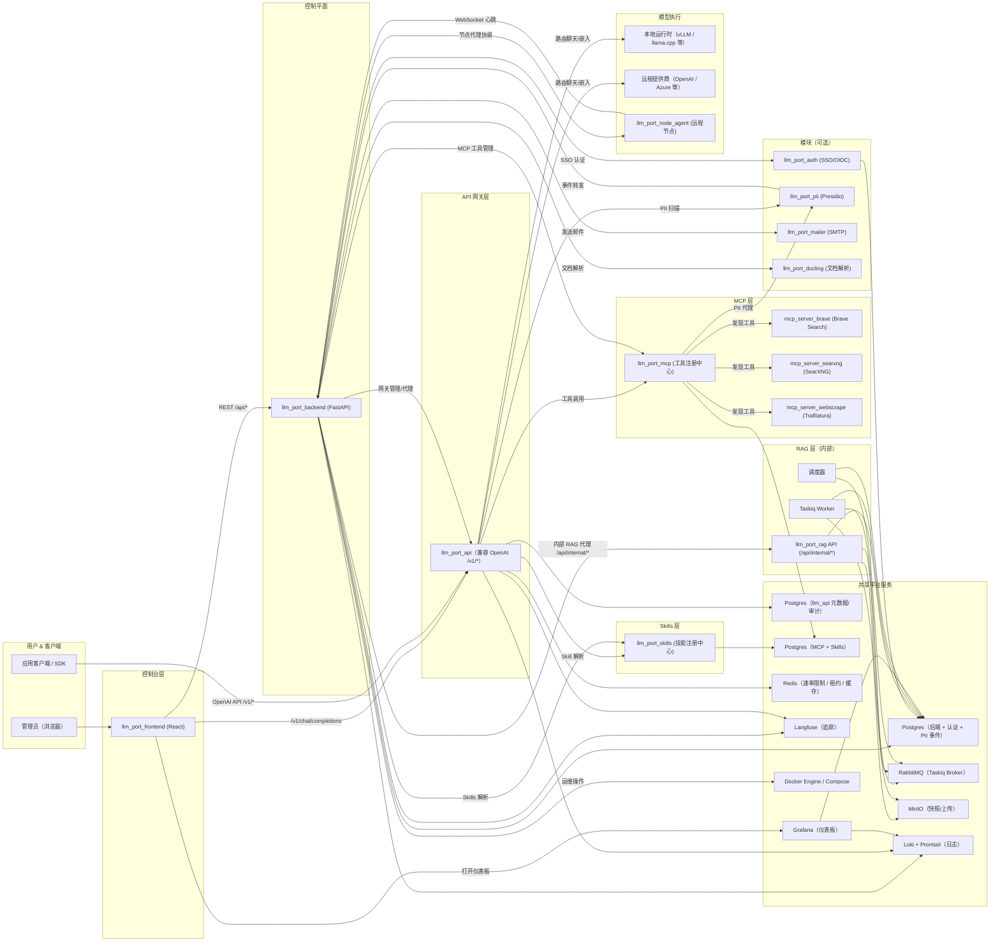

# 架构

本页介绍 **llm.Port** 的高层架构——平台的各个层面、服务和数据流。

## 平台概览

## 各层说明

### 控制台层

**React 前端**提供管理控制台——一个用于管理提供商、模型、容器、RAG、PII 策略和系统设置的单页应用。

### 控制平面

**FastAPI 后端**是中枢协调器，负责：

- 用户管理、RBAC 和认证
- LLM 提供商和运行时配置
- 通过 Docker API 进行容器生命周期管理
- 系统设置（含加密和应用编排）
- 代理内部请求至 RAG 和网关

### API 网关层

**网关**暴露兼容 OpenAI 的 API（`/v1/models`、`/v1/chat/completions`、`/v1/embeddings`），处理：

- 基于别名的模型解析和提供商路由
- 带租户感知声明的 JWT 认证
- 基于 Redis 的速率限制和并发租约
- 带 TTFT 提取的 SSE 流式传输
- Langfuse 追踪和审计日志

### 可选模块

可通过 Docker Compose Profiles 启用或禁用的独立服务：

- **Auth** — 带 OAuth 提供商适配器的 SSO / OIDC 认证
- **PII** — 基于 Presidio 的 PII 扫描、脱敏和令牌化
- **Mailer** — 带 Jinja2 模板的邮件通知
- **Docling** — 基于 IBM Docling 的文档处理，用于文本提取

### MCP 层

**MCP 工具注册中心**（`llm_port_mcp`）是 Model Context Protocol 工具服务器的受治理代理：

- 注册 MCP 兼容服务器（stdio、SSE、Streamable HTTP 传输）
- 自动发现工具并转换为 OpenAI 兼容的工具定义
- 所有工具调用通过 **Privacy Proxy**（基于 Presidio 的 PII 检测）
- 使用 Fernet 加密服务器凭据

内置 MCP 服务器包括 **Brave Search**、**SearXNG**（自托管，无需 API 密钥）和 **Web Scrape**（基于 Trafilatura 的内容提取）。

### Skills 层

**Skills 注册中心**（`llm_port_skills`）管理可重用的推理 Playbook。Skills 是带有 YAML Frontmatter 的 Markdown 文档，决定系统如何推理特定类别的请求——位于 RAG 上下文、MCP 工具和 Prompt 组合之间。

### 节点代理

**节点代理**（`llm_port_node_agent`）是用于多节点部署的轻量级主机端二进制文件：

- 使用一次性令牌向后端注册
- 维持认证的 WebSocket 连接用于心跳和命令分发
- 在远程节点上执行 Docker 运行时生命周期命令
- 日志发送到 Loki（Linux 上的 journald，Windows 上的 Event Log）
- 以独立二进制文件分发（节点上无需安装 Python）

### RAG 层

**RAG 子系统**是只能通过后端访问的内部服务，管理：

- 文档摄取：上传 → 提取 → 分块 → 嵌入 → 索引
- 知识检索：向量、关键词和混合评分（含 ACL 执行）
- 支持草稿/发布工作流的虚拟容器
- 通过 Taskiq + RabbitMQ 的异步处理

### 共享平台服务

通过 Docker Compose 管理的基础设施容器：

| 服务          | 用途                                                                          |
| ------------- | ----------------------------------------------------------------------------- |
| PostgreSQL    | 后端元数据、认证、PII 事件、RAG 向量（pgvector）、网关审计、MCP + Skills 数据 |
| Redis         | 速率限制、并发租约、缓存                                                      |
| RabbitMQ      | 异步任务代理（Taskiq）                                                        |
| MinIO         | 上传和快照的对象存储                                                          |
| Langfuse      | LLM 追踪和生成事件存储                                                        |
| Loki + Alloy  | 集中式日志收集和查询                                                          |
| Grafana       | 仪表板和可视化                                                                |
| Docker Engine | 运行时的容器编排                                                              |

## 调用路径

1. **管理员操作** — `浏览器 → 前端 → 后端 → Docker / 设置 / 代理目标`
2. **应用推理** — `应用/SDK → 网关 → 本地运行时或远程提供商 → 响应`
3. **控制台聊天** — `前端 → 网关 /v1/chat/completions → LLM → SSE 流式响应`
4. **RAG 查询** — `前端 → 后端 /api/admin/rag/* → RAG /api/internal/knowledge/search`
5. **RAG 发布** — `上传 → MinIO → RabbitMQ → Worker → 提取/分块/嵌入/索引`
6. **PII 筛查** — `网关 → PII 服务 → 返回已脱敏文本 + 事件 → 后端存储`
7. **SSO 认证** — `前端 → 后端 → Auth 服务 → IdP → JWT 颁发`
8. **邮件通知** — `后端 → Mailer 服务 → SMTP`
9. **文档解析** — `后端 → Docling 服务 → 结构化输出`
10. **可观测性** — `后端 + 网关 + RAG → Loki / Langfuse → Grafana 仪表板`
11. **MCP 工具调用** — `网关 → MCP Hub → Privacy Proxy（PII 扫描）→ MCP 服务器 → 工具结果 → 网关`
12. **Skill 解析** — `网关（预提示）→ Skills /resolve → 匹配的 Playbook → Prompt 组合`
13. **节点代理分发** — `后端 → WebSocket → 节点代理 → Docker 生命周期命令 → 状态报告`

有关每个流的详细序列图，请参阅[调用序列](/docs/call-sequences)。
