# 调用序列

**llm.Port** 中每个主要流程的详细 Mermaid 序列图。

## 1. 端到端概览

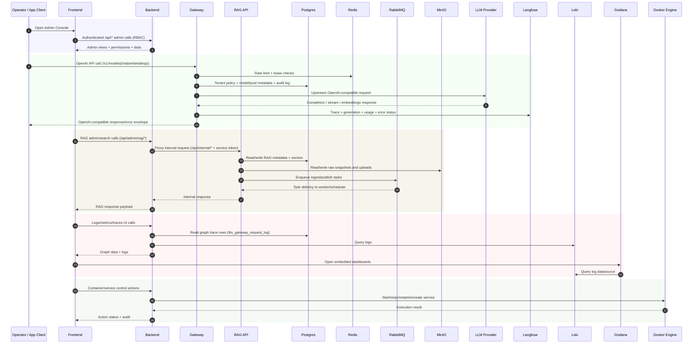
```mermaid
sequenceDiagram
    autonumber
    participant U as Operator / App Client
    participant FE as Frontend
    participant BE as Backend
    participant GW as Gateway
    participant RAG as RAG API
    participant PG as Postgres
    participant R as Redis
    participant RMQ as RabbitMQ
    participant MIO as MinIO
    participant LP as LLM Provider
    participant LF as Langfuse
    participant LK as Loki
    participant GF as Grafana
    participant DE as Docker Engine

    rect rgb(245,245,255)
    U->>FE: Open Admin Console
    FE->>BE: Authenticated /api/* admin calls (RBAC)
    BE-->>FE: Admin views + permissions + data
    end

    rect rgb(245,255,245)
    U->>GW: OpenAI API call (/v1/models|chat|embeddings)
    GW->>R: Rate limit + lease checks
    GW->>PG: Tenant policy + model/pool metadata + audit log
    GW->>LP: Upstream OpenAI-compatible request
    LP-->>GW: Completion / stream / embeddings response
    GW->>LF: Trace + generation + usage + error status
    GW-->>U: OpenAI-compatible response/error envelope
    end

    rect rgb(245,245,235)
    FE->>BE: RAG admin/search calls (/api/admin/rag/*)
    BE->>RAG: Proxy internal request (/api/internal/* + service token)
    RAG->>PG: Read/write RAG metadata + vectors
    RAG->>MIO: Read/write raw snapshots and uploads
    RAG->>RMQ: Enqueue ingest/publish tasks
    RMQ-->>RAG: Task delivery to worker/scheduler
    RAG-->>BE: Internal response
    BE-->>FE: RAG response payload
    end

    rect rgb(255,245,245)
    FE->>BE: Logs/metrics/traces UI calls
    BE->>PG: Read graph trace rows (llm_gateway_request_log)
    BE->>LK: Query logs
    BE-->>FE: Graph data + logs
    FE->>GF: Open embedded dashboards
    GF->>LK: Query log datasource
    end

    rect rgb(245,250,245)
    FE->>BE: Container/service control actions
    BE->>DE: Start/stop/restart/recreate service
    DE-->>BE: Execution result
    BE-->>FE: Action status + audit
    end
```

## 2. 聊天补全（非流式）

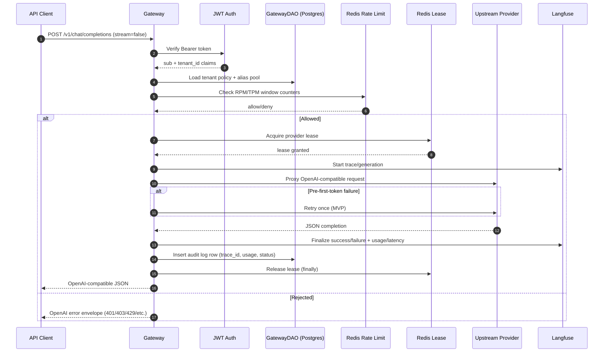
```mermaid
sequenceDiagram
    autonumber
    participant C as API Client
    participant GW as Gateway
    participant AUTH as JWT Auth
    participant DAO as GatewayDAO (Postgres)
    participant RL as Redis Rate Limit
    participant LEASE as Redis Lease
    participant UP as Upstream Provider
    participant OBS as Langfuse

    C->>GW: POST /v1/chat/completions (stream=false)
    GW->>AUTH: Verify Bearer token
    AUTH-->>GW: sub + tenant_id claims
    GW->>DAO: Load tenant policy + alias pool
    GW->>RL: Check RPM/TPM window counters
    RL-->>GW: allow/deny
    alt Allowed
      GW->>LEASE: Acquire provider lease
      LEASE-->>GW: lease granted
      GW->>OBS: Start trace/generation
      GW->>UP: Proxy OpenAI-compatible request
      alt Pre-first-token failure
        GW->>UP: Retry once (MVP)
      end
      UP-->>GW: JSON completion
      GW->>OBS: Finalize success/failure + usage/latency
      GW->>DAO: Insert audit log row (trace_id, usage, status)
      GW->>LEASE: Release lease (finally)
      GW-->>C: OpenAI-compatible JSON
    else Rejected
      GW-->>C: OpenAI error envelope (401/403/429/etc.)
    end
```

## 3. 聊天补全（SSE 流式）

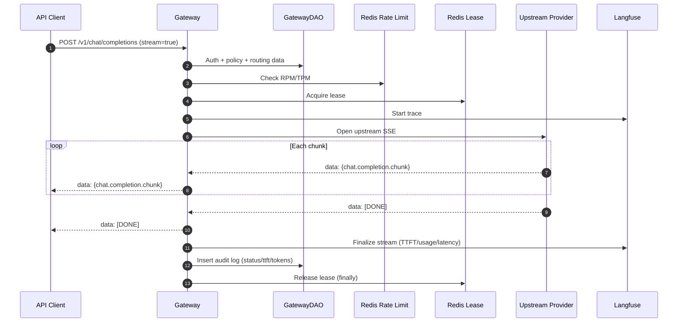
```mermaid
sequenceDiagram
    autonumber
    participant C as API Client
    participant GW as Gateway
    participant DAO as GatewayDAO
    participant RL as Redis Rate Limit
    participant LEASE as Redis Lease
    participant UP as Upstream Provider
    participant OBS as Langfuse

    C->>GW: POST /v1/chat/completions (stream=true)
    GW->>DAO: Auth + policy + routing data
    GW->>RL: Check RPM/TPM
    GW->>LEASE: Acquire lease
    GW->>OBS: Start trace
    GW->>UP: Open upstream SSE
    loop Each chunk
      UP-->>GW: data: {chat.completion.chunk}
      GW-->>C: data: {chat.completion.chunk}
    end
    UP-->>GW: data: [DONE]
    GW-->>C: data: [DONE]
    GW->>OBS: Finalize stream (TTFT/usage/latency)
    GW->>DAO: Insert audit log (status/ttft/tokens)
    GW->>LEASE: Release lease (finally)
```

## 4. 嵌入向量

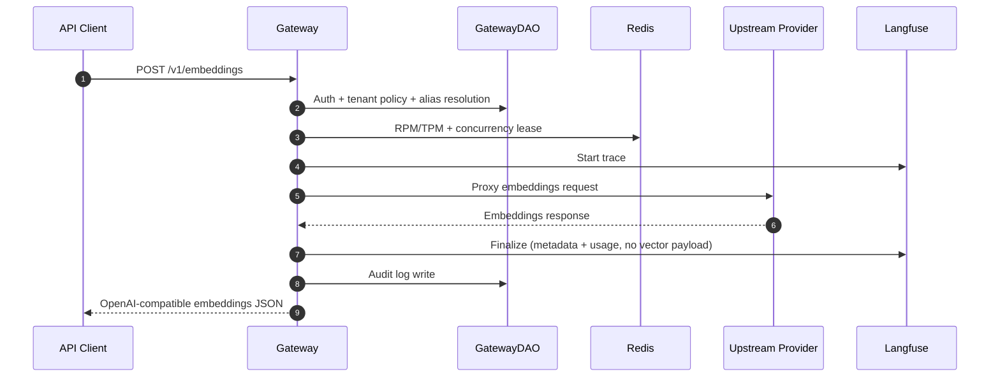
```mermaid
sequenceDiagram
    autonumber
    participant C as API Client
    participant GW as Gateway
    participant DAO as GatewayDAO
    participant R as Redis
    participant UP as Upstream Provider
    participant OBS as Langfuse

    C->>GW: POST /v1/embeddings
    GW->>DAO: Auth + tenant policy + alias resolution
    GW->>R: RPM/TPM + concurrency lease
    GW->>OBS: Start trace
    GW->>UP: Proxy embeddings request
    UP-->>GW: Embeddings response
    GW->>OBS: Finalize (metadata + usage, no vector payload)
    GW->>DAO: Audit log write
    GW-->>C: OpenAI-compatible embeddings JSON
```

## 5. LLM 拓扑 & 实时追踪

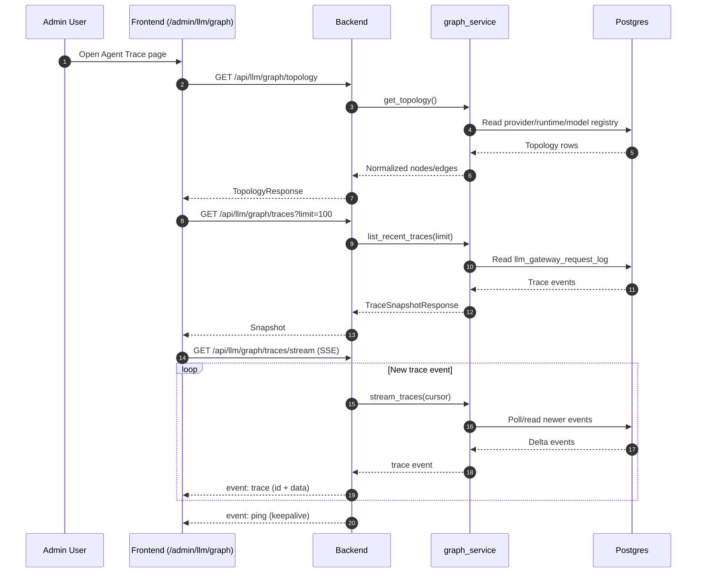
```mermaid
sequenceDiagram
    autonumber
    participant U as Admin User
    participant FE as Frontend (/admin/llm/graph)
    participant BE as Backend
    participant SVC as graph_service
    participant PG as Postgres

    U->>FE: Open Agent Trace page
    FE->>BE: GET /api/llm/graph/topology
    BE->>SVC: get_topology()
    SVC->>PG: Read provider/runtime/model registry
    PG-->>SVC: Topology rows
    SVC-->>BE: Normalized nodes/edges
    BE-->>FE: TopologyResponse

    FE->>BE: GET /api/llm/graph/traces?limit=100
    BE->>SVC: list_recent_traces(limit)
    SVC->>PG: Read llm_gateway_request_log
    PG-->>SVC: Trace events
    SVC-->>BE: TraceSnapshotResponse
    BE-->>FE: Snapshot

    FE->>BE: GET /api/llm/graph/traces/stream (SSE)
    loop New trace event
      BE->>SVC: stream_traces(cursor)
      SVC->>PG: Poll/read newer events
      PG-->>SVC: Delta events
      SVC-->>BE: trace event
      BE-->>FE: event: trace (id + data)
    end
    BE-->>FE: event: ping (keepalive)
```

## 6. 容器管理

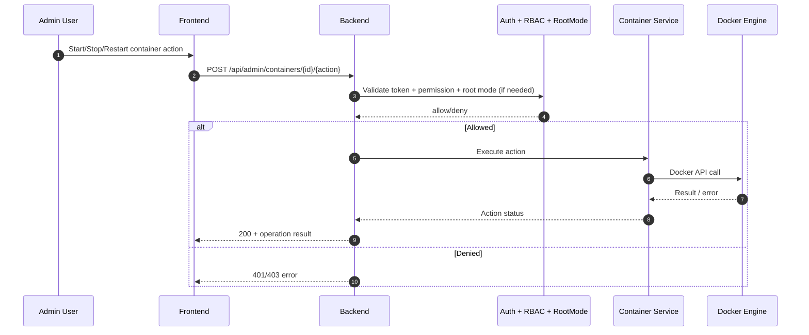
```mermaid
sequenceDiagram
    autonumber
    participant U as Admin User
    participant FE as Frontend
    participant BE as Backend
    participant RBAC as Auth + RBAC + RootMode
    participant OPS as Container Service
    participant DE as Docker Engine

    U->>FE: Start/Stop/Restart container action
    FE->>BE: POST /api/admin/containers/{id}/{action}
    BE->>RBAC: Validate token + permission + root mode (if needed)
    RBAC-->>BE: allow/deny
    alt Allowed
      BE->>OPS: Execute action
      OPS->>DE: Docker API call
      DE-->>OPS: Result / error
      OPS-->>BE: Action status
      BE-->>FE: 200 + operation result
    else Denied
      BE-->>FE: 401/403 error
    end
```

## 7. 系统设置（应用）

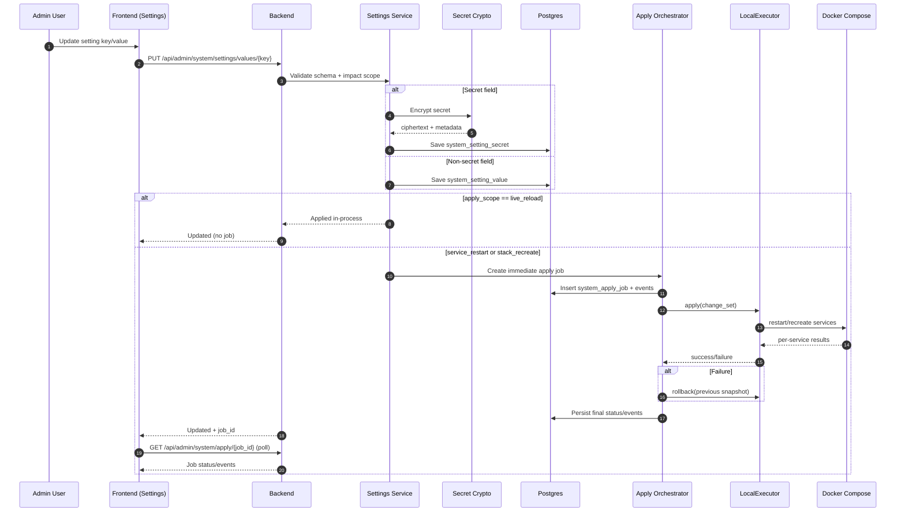
```mermaid
sequenceDiagram
    autonumber
    participant U as Admin User
    participant FE as Frontend (Settings)
    participant BE as Backend
    participant SET as Settings Service
    participant ENC as Secret Crypto
    participant DB as Postgres
    participant APPLY as Apply Orchestrator
    participant EXEC as LocalExecutor
    participant DE as Docker Compose

    U->>FE: Update setting key/value
    FE->>BE: PUT /api/admin/system/settings/values/{key}
    BE->>SET: Validate schema + impact scope
    alt Secret field
      SET->>ENC: Encrypt secret
      ENC-->>SET: ciphertext + metadata
      SET->>DB: Save system_setting_secret
    else Non-secret field
      SET->>DB: Save system_setting_value
    end

    alt apply_scope == live_reload
      SET-->>BE: Applied in-process
      BE-->>FE: Updated (no job)
    else service_restart or stack_recreate
      SET->>APPLY: Create immediate apply job
      APPLY->>DB: Insert system_apply_job + events
      APPLY->>EXEC: apply(change_set)
      EXEC->>DE: restart/recreate services
      DE-->>EXEC: per-service results
      EXEC-->>APPLY: success/failure
      alt Failure
        APPLY->>EXEC: rollback(previous snapshot)
      end
      APPLY->>DB: Persist final status/events
      BE-->>FE: Updated + job_id
      FE->>BE: GET /api/admin/system/apply/{job_id} (poll)
      BE-->>FE: Job status/events
    end
```

## 8. 初始化向导

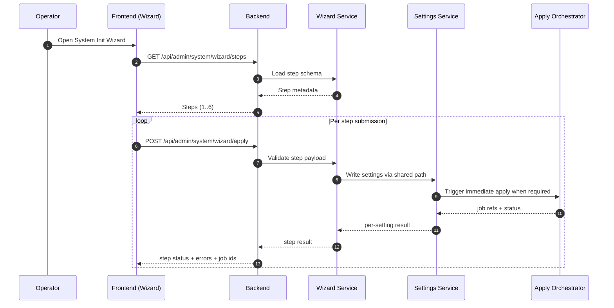
```mermaid
sequenceDiagram
    autonumber
    participant U as Operator
    participant FE as Frontend (Wizard)
    participant BE as Backend
    participant WIZ as Wizard Service
    participant SET as Settings Service
    participant APPLY as Apply Orchestrator

    U->>FE: Open System Init Wizard
    FE->>BE: GET /api/admin/system/wizard/steps
    BE->>WIZ: Load step schema
    WIZ-->>BE: Step metadata
    BE-->>FE: Steps (1..6)

    loop Per step submission
      FE->>BE: POST /api/admin/system/wizard/apply
      BE->>WIZ: Validate step payload
      WIZ->>SET: Write settings via shared path
      SET->>APPLY: Trigger immediate apply when required
      APPLY-->>SET: job refs + status
      SET-->>WIZ: per-setting result
      WIZ-->>BE: step result
      BE-->>FE: step status + errors + job ids
    end
```

## 9. 多主机 Agent

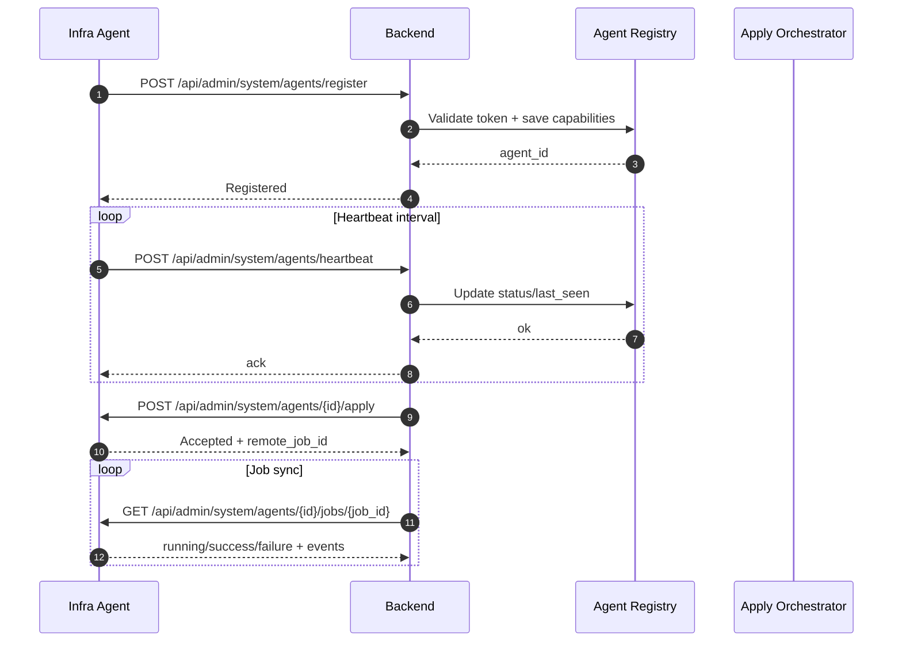
```mermaid
sequenceDiagram
    autonumber
    participant AG as Infra Agent
    participant BE as Backend
    participant REG as Agent Registry
    participant APPLY as Apply Orchestrator

    AG->>BE: POST /api/admin/system/agents/register
    BE->>REG: Validate token + save capabilities
    REG-->>BE: agent_id
    BE-->>AG: Registered

    loop Heartbeat interval
      AG->>BE: POST /api/admin/system/agents/heartbeat
      BE->>REG: Update status/last_seen
      REG-->>BE: ok
      BE-->>AG: ack
    end

    BE->>AG: POST /api/admin/system/agents/{id}/apply
    AG-->>BE: Accepted + remote_job_id
    loop Job sync
      BE->>AG: GET /api/admin/system/agents/{id}/jobs/{job_id}
      AG-->>BE: running/success/failure + events
    end
```

## 10. 日志与可观测性

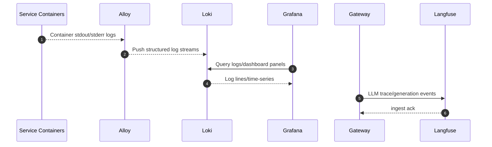
```mermaid
sequenceDiagram
    autonumber
    participant APP as Service Containers
    participant AL as Alloy
    participant LK as Loki
    participant GF as Grafana
    participant GW as Gateway
    participant LF as Langfuse

    APP-->>AL: Container stdout/stderr logs
    AL-->>LK: Push structured log streams
    GF->>LK: Query logs/dashboard panels
    LK-->>GF: Log lines/time-series

    GW->>LF: LLM trace/generation events
    LF-->>GW: ingest ack
```

## 11. RAG 搜索

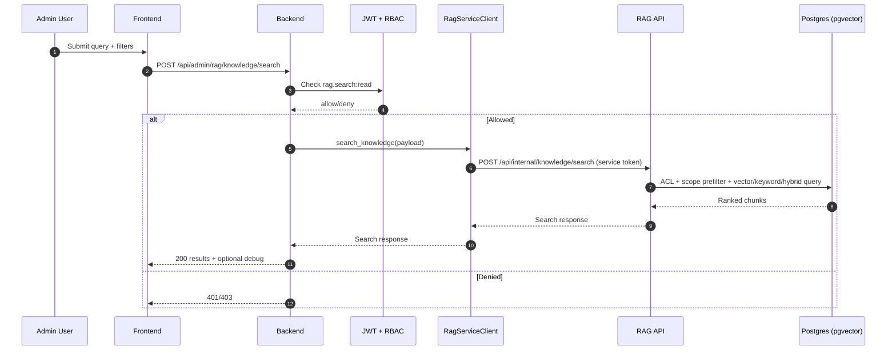
```mermaid
sequenceDiagram
    autonumber
    participant U as Admin User
    participant FE as Frontend
    participant BE as Backend
    participant RBAC as JWT + RBAC
    participant RC as RagServiceClient
    participant RAG as RAG API
    participant DB as Postgres (pgvector)

    U->>FE: Submit query + filters
    FE->>BE: POST /api/admin/rag/knowledge/search
    BE->>RBAC: Check rag.search:read
    RBAC-->>BE: allow/deny
    alt Allowed
      BE->>RC: search_knowledge(payload)
      RC->>RAG: POST /api/internal/knowledge/search (service token)
      RAG->>DB: ACL + scope prefilter + vector/keyword/hybrid query
      DB-->>RAG: Ranked chunks
      RAG-->>RC: Search response
      RC-->>BE: Search response
      BE-->>FE: 200 results + optional debug
    else Denied
      BE-->>FE: 401/403
    end
```

## 12. RAG 上传 & 发布

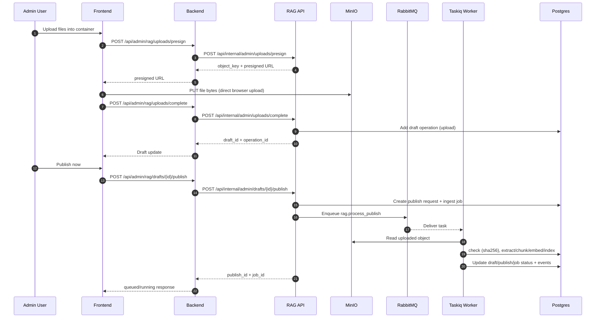
```mermaid
sequenceDiagram
    autonumber
    participant U as Admin User
    participant FE as Frontend
    participant BE as Backend
    participant RAG as RAG API
    participant MIO as MinIO
    participant RMQ as RabbitMQ
    participant W as Taskiq Worker
    participant DB as Postgres

    U->>FE: Upload files into container
    FE->>BE: POST /api/admin/rag/uploads/presign
    BE->>RAG: POST /api/internal/admin/uploads/presign
    RAG-->>BE: object_key + presigned URL
    BE-->>FE: presigned URL
    FE->>MIO: PUT file bytes (direct browser upload)
    FE->>BE: POST /api/admin/rag/uploads/complete
    BE->>RAG: POST /api/internal/admin/uploads/complete
    RAG->>DB: Add draft operation (upload)
    RAG-->>BE: draft_id + operation_id
    BE-->>FE: Draft update

    U->>FE: Publish now
    FE->>BE: POST /api/admin/rag/drafts/{id}/publish
    BE->>RAG: POST /api/internal/admin/drafts/{id}/publish
    RAG->>DB: Create publish request + ingest job
    RAG->>RMQ: Enqueue rag.process_publish
    RMQ-->>W: Deliver task
    W->>MIO: Read uploaded object
    W->>DB: check (sha256), extract/chunk/embed/index
    W->>DB: Update draft/publish/job status + events
    RAG-->>BE: publish_id + job_id
    BE-->>FE: queued/running response
```

## 13. 定时发布

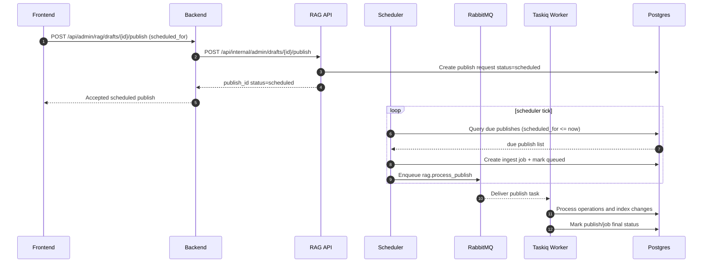
```mermaid
sequenceDiagram
    autonumber
    participant FE as Frontend
    participant BE as Backend
    participant RAG as RAG API
    participant S as Scheduler
    participant RMQ as RabbitMQ
    participant W as Taskiq Worker
    participant DB as Postgres

    FE->>BE: POST /api/admin/rag/drafts/{id}/publish (scheduled_for)
    BE->>RAG: POST /api/internal/admin/drafts/{id}/publish
    RAG->>DB: Create publish request status=scheduled
    RAG-->>BE: publish_id status=scheduled
    BE-->>FE: Accepted scheduled publish

    loop scheduler tick
      S->>DB: Query due publishes (scheduled_for <= now)
      DB-->>S: due publish list
      S->>DB: Create ingest job + mark queued
      S->>RMQ: Enqueue rag.process_publish
    end

    RMQ-->>W: Deliver publish task
    W->>DB: Process operations and index changes
    W->>DB: Mark publish/job final status
```

## 14. 控制台聊天补全

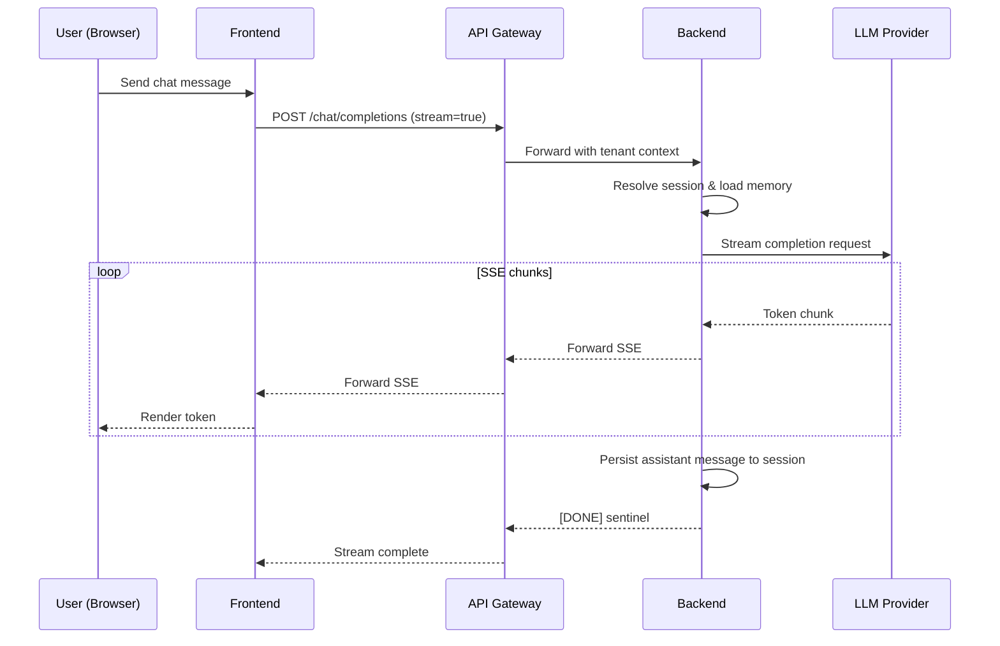
```mermaid
sequenceDiagram
    participant U as User (Browser)
    participant FE as Frontend
    participant API as API Gateway
    participant BE as Backend
    participant LLM as LLM Provider

    U->>FE: Send chat message
    FE->>API: POST /chat/completions (stream=true)
    API->>BE: Forward with tenant context
    BE->>BE: Resolve session & load memory
    BE->>LLM: Stream completion request
    loop SSE chunks
        LLM-->>BE: Token chunk
        BE-->>API: Forward SSE
        API-->>FE: Forward SSE
        FE-->>U: Render token
    end
    BE->>BE: Persist assistant message to session
    BE-->>API: [DONE] sentinel
    API-->>FE: Stream complete
```

## 15. 会话与记忆生命周期

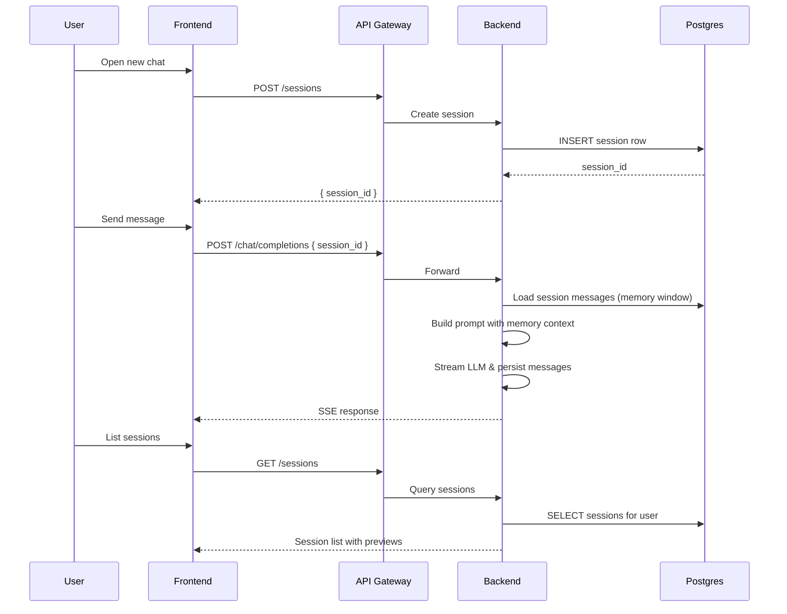
```mermaid
sequenceDiagram
    participant U as User
    participant FE as Frontend
    participant API as API Gateway
    participant BE as Backend
    participant DB as Postgres

    U->>FE: Open new chat
    FE->>API: POST /sessions
    API->>BE: Create session
    BE->>DB: INSERT session row
    DB-->>BE: session_id
    BE-->>FE: { session_id }

    U->>FE: Send message
    FE->>API: POST /chat/completions { session_id }
    API->>BE: Forward
    BE->>DB: Load session messages (memory window)
    BE->>BE: Build prompt with memory context
    BE->>BE: Stream LLM & persist messages
    BE-->>FE: SSE response

    U->>FE: List sessions
    FE->>API: GET /sessions
    API->>BE: Query sessions
    BE->>DB: SELECT sessions for user
    BE-->>FE: Session list with previews
```

## 16. 文件附件上传与提取

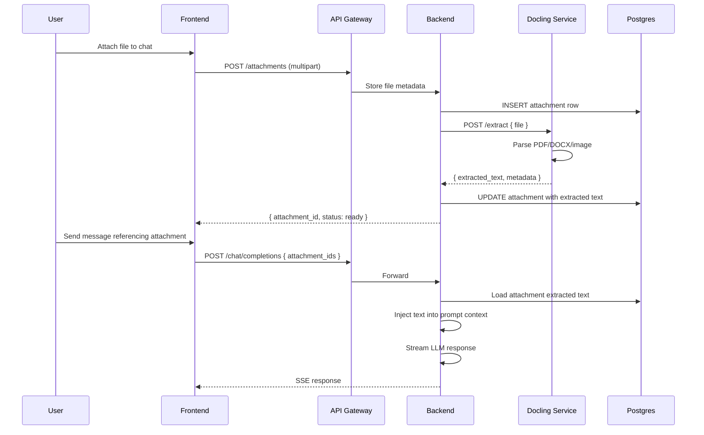
```mermaid
sequenceDiagram
    participant U as User
    participant FE as Frontend
    participant API as API Gateway
    participant BE as Backend
    participant DOC as Docling Service
    participant DB as Postgres

    U->>FE: Attach file to chat
    FE->>API: POST /attachments (multipart)
    API->>BE: Store file metadata
    BE->>DB: INSERT attachment row
    BE->>DOC: POST /extract { file }
    DOC->>DOC: Parse PDF/DOCX/image
    DOC-->>BE: { extracted_text, metadata }
    BE->>DB: UPDATE attachment with extracted text
    BE-->>FE: { attachment_id, status: ready }

    U->>FE: Send message referencing attachment
    FE->>API: POST /chat/completions { attachment_ids }
    API->>BE: Forward
    BE->>DB: Load attachment extracted text
    BE->>BE: Inject text into prompt context
    BE->>BE: Stream LLM response
    BE-->>FE: SSE response
```

## 17. PII 筛查管道

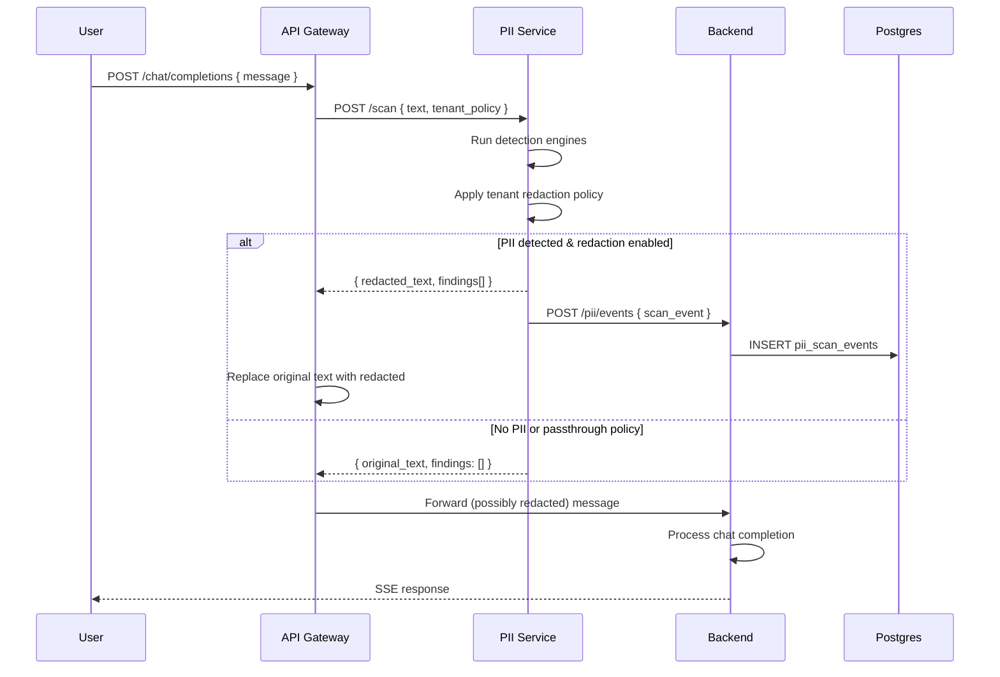
```mermaid
sequenceDiagram
    participant U as User
    participant API as API Gateway
    participant PII as PII Service
    participant BE as Backend
    participant DB as Postgres

    U->>API: POST /chat/completions { message }
    API->>PII: POST /scan { text, tenant_policy }
    PII->>PII: Run detection engines
    PII->>PII: Apply tenant redaction policy

    alt PII detected & redaction enabled
        PII-->>API: { redacted_text, findings[] }
        PII->>BE: POST /pii/events { scan_event }
        BE->>DB: INSERT pii_scan_events
        API->>API: Replace original text with redacted
    else No PII or passthrough policy
        PII-->>API: { original_text, findings: [] }
    end

    API->>BE: Forward (possibly redacted) message
    BE->>BE: Process chat completion
    BE-->>U: SSE response
```

## 18. SSO 认证流程

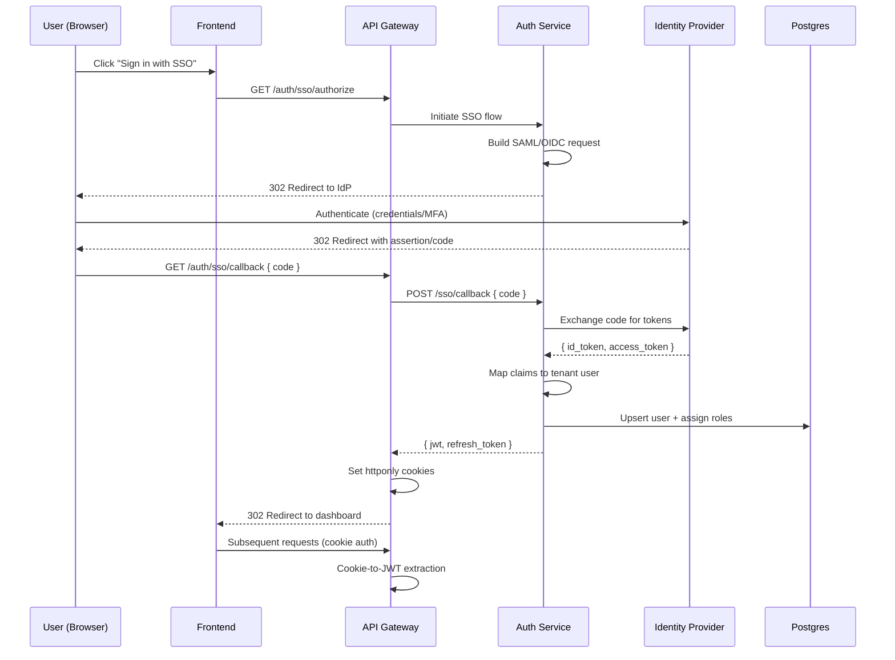
```mermaid
sequenceDiagram
    participant U as User (Browser)
    participant FE as Frontend
    participant API as API Gateway
    participant AUTH as Auth Service
    participant IDP as Identity Provider
    participant DB as Postgres

    U->>FE: Click "Sign in with SSO"
    FE->>API: GET /auth/sso/authorize
    API->>AUTH: Initiate SSO flow
    AUTH->>AUTH: Build SAML/OIDC request
    AUTH-->>U: 302 Redirect to IdP

    U->>IDP: Authenticate (credentials/MFA)
    IDP-->>U: 302 Redirect with assertion/code
    U->>API: GET /auth/sso/callback { code }
    API->>AUTH: POST /sso/callback { code }
    AUTH->>IDP: Exchange code for tokens
    IDP-->>AUTH: { id_token, access_token }
    AUTH->>AUTH: Map claims to tenant user
    AUTH->>DB: Upsert user + assign roles
    AUTH-->>API: { jwt, refresh_token }
    API->>API: Set httponly cookies
    API-->>FE: 302 Redirect to dashboard
    FE->>API: Subsequent requests (cookie auth)
    API->>API: Cookie-to-JWT extraction
```

## 19. 通知推送管道

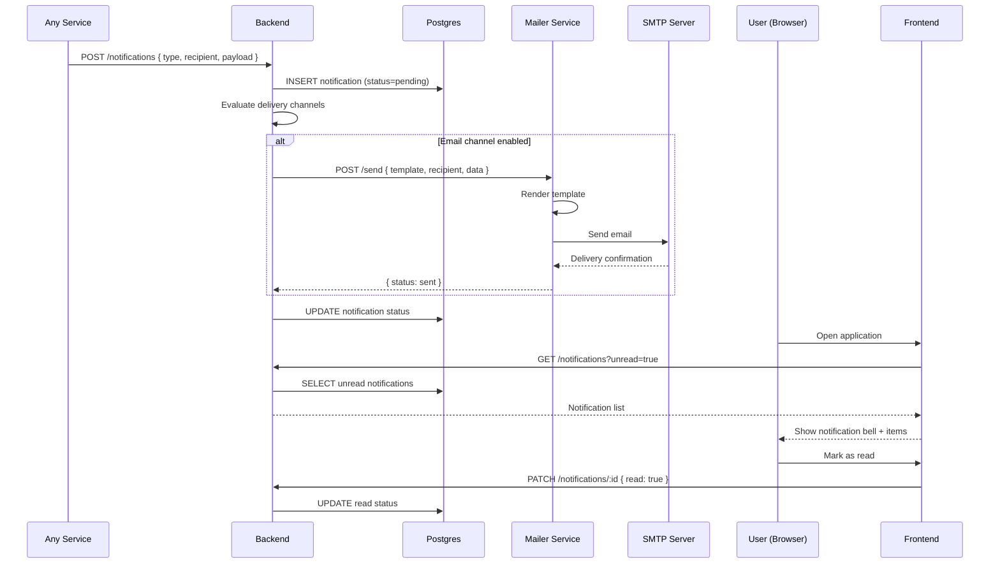
```mermaid
sequenceDiagram
    participant SVC as Any Service
    participant BE as Backend
    participant DB as Postgres
    participant MAIL as Mailer Service
    participant SMTP as SMTP Server
    participant U as User (Browser)
    participant FE as Frontend

    SVC->>BE: POST /notifications { type, recipient, payload }
    BE->>DB: INSERT notification (status=pending)
    BE->>BE: Evaluate delivery channels

    alt Email channel enabled
        BE->>MAIL: POST /send { template, recipient, data }
        MAIL->>MAIL: Render template
        MAIL->>SMTP: Send email
        SMTP-->>MAIL: Delivery confirmation
        MAIL-->>BE: { status: sent }
    end

    BE->>DB: UPDATE notification status

    U->>FE: Open application
    FE->>BE: GET /notifications?unread=true
    BE->>DB: SELECT unread notifications
    BE-->>FE: Notification list
    FE-->>U: Show notification bell + items
    U->>FE: Mark as read
    FE->>BE: PATCH /notifications/:id { read: true }
    BE->>DB: UPDATE read status
```

## 20. 模块启用/禁用生命周期

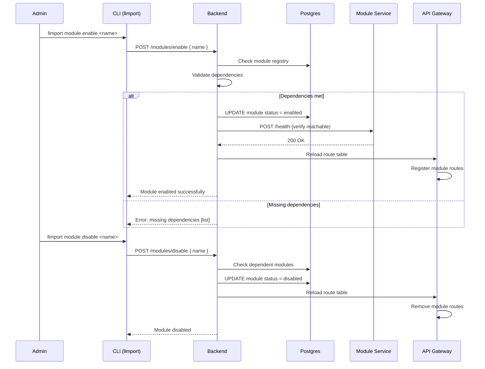
```mermaid
sequenceDiagram
    participant ADM as Admin
    participant CLI as CLI (llmport)
    participant BE as Backend
    participant DB as Postgres
    participant MOD as Module Service
    participant GW as API Gateway

    ADM->>CLI: llmport module enable <name>
    CLI->>BE: POST /modules/enable { name }
    BE->>DB: Check module registry
    BE->>BE: Validate dependencies

    alt Dependencies met
        BE->>DB: UPDATE module status = enabled
        BE->>MOD: POST /health (verify reachable)
        MOD-->>BE: 200 OK
        BE->>GW: Reload route table
        GW->>GW: Register module routes
        BE-->>CLI: Module enabled successfully
    else Missing dependencies
        BE-->>CLI: Error: missing dependencies [list]
    end

    ADM->>CLI: llmport module disable <name>
    CLI->>BE: POST /modules/disable { name }
    BE->>DB: Check dependent modules
    BE->>DB: UPDATE module status = disabled
    BE->>GW: Reload route table
    GW->>GW: Remove module routes
    BE-->>CLI: Module disabled
```
